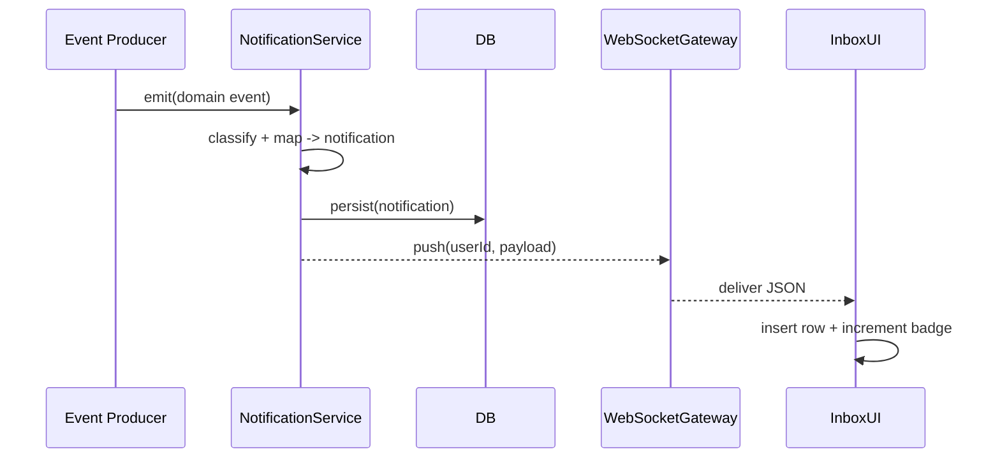

# Admin Notification Inbox System

**Version:** 1.0  
**Status:** Design Phase  
**Last Updated:** October 3, 2025

## 1. Overview

A **centralized notification system** for admin users, inspired by ClickUp's Inbox pattern. This provides a unified interface for all system notifications, alerts, and actionable items requiring admin attention.

### 1.1. Purpose

- Centralize all admin notifications in one place
- Provide actionable alerts for imports, extractions, reviews, and system events
- Enable efficient triage with filtering, grouping, and prioritization
- Support keyboard-driven workflows for power users
- Maintain audit trail of admin awareness and actions

### 1.2. Key Features

- **Tab-based Interface**: Important, Other, Snoozed, Cleared
- **Smart Grouping**: Related notifications grouped by entity or sync job
- **Rich Actions**: Mark read/unread, snooze, clear, deep links
- **Powerful Filters**: By category, assignment, read status
- **Real-time Updates**: Live notification delivery via WebSocket/SSE
- **Keyboard Shortcuts**: Efficient power-user workflows
- **Retention Policy**: 30-day retention for cleared items

### 1.3. Use Cases

1. **Integration Management**
   - Notification when import completes
   - Alert when imported items need review
   - Warning when sync conflicts detected
   - Error notifications for failed imports

2. **Extraction Workflow**
   - Notification when extraction job completes
   - Alert for low-confidence entities
   - Review requests for ambiguous extractions

3. **Collaboration**
   - @mentions in comments
   - Assignment notifications
   - Comment threads

4. **System Events**
   - Error alerts
   - Rate limit warnings
   - System maintenance notifications

---

### 1.4. High-Level Flow (Wireframe Reference)



This diagram mirrors the Storybook wireframe states (`loading`, `default`, `empty`) added under `Wireframes/NotificationInbox`.

---

## 2. Database Schema

### 2.1. Notifications Table

```sql
CREATE TABLE kb.notifications (
  id UUID PRIMARY KEY DEFAULT gen_random_uuid(),
  tenant_id UUID NOT NULL,
  organization_id UUID,
  project_id UUID,
  
  -- Recipient
  user_id UUID NOT NULL REFERENCES kb.users(id) ON DELETE CASCADE,
  
  -- Notification classification
  category TEXT NOT NULL,            -- 'import', 'review', 'conflict', 'error', 'system', 'mention'
  importance TEXT NOT NULL DEFAULT 'other', -- 'important', 'other'
  
  -- Content
  title TEXT NOT NULL,
  message TEXT NOT NULL,
  details JSONB,
  
  -- Source tracking
  source_type TEXT,                  -- 'integration', 'extraction_job', 'graph_object', 'user'
  source_id UUID,                    -- Integration ID, job ID, object ID, etc.
  
  -- Actions
  action_url TEXT,                   -- Deep link to relevant page
  action_label TEXT,                 -- "Review Import", "View Object", etc.
  
  -- State
  read_at TIMESTAMPTZ,
  cleared_at TIMESTAMPTZ,
  snoozed_until TIMESTAMPTZ,
  
  -- Grouping
  group_key TEXT,                    -- Group related notifications (e.g., sync_job_xyz)
  
  created_at TIMESTAMPTZ NOT NULL DEFAULT now()
);

CREATE INDEX idx_notifications_user ON kb.notifications(user_id, created_at DESC);
CREATE INDEX idx_notifications_unread ON kb.notifications(user_id) WHERE read_at IS NULL;
CREATE INDEX idx_notifications_important ON kb.notifications(user_id, importance) WHERE cleared_at IS NULL;
CREATE INDEX idx_notifications_snoozed ON kb.notifications(snoozed_until) WHERE snoozed_until IS NOT NULL;
CREATE INDEX idx_notifications_group ON kb.notifications(group_key, created_at DESC);
CREATE INDEX idx_notifications_cleared ON kb.notifications(user_id, cleared_at) WHERE cleared_at IS NOT NULL;

-- Auto-delete cleared notifications older than 30 days
CREATE OR REPLACE FUNCTION delete_old_cleared_notifications()
RETURNS void AS $$
BEGIN
  DELETE FROM kb.notifications
  WHERE cleared_at IS NOT NULL
    AND cleared_at < now() - interval '30 days';
END;
$$ LANGUAGE plpgsql;

-- Schedule cleanup (run daily)
-- SELECT cron.schedule('cleanup-notifications', '0 2 * * *', $$SELECT delete_old_cleared_notifications()$$);
```

### 2.2. User Notification Preferences

```sql
CREATE TABLE kb.user_notification_preferences (
  id UUID PRIMARY KEY DEFAULT gen_random_uuid(),
  user_id UUID NOT NULL REFERENCES kb.users(id) ON DELETE CASCADE,
  
  -- Category-specific preferences
  category TEXT NOT NULL,             -- 'import', 'extraction', 'mention', etc.
  
  -- Delivery channels
  in_app_enabled BOOLEAN DEFAULT true,
  email_enabled BOOLEAN DEFAULT false,
  email_digest BOOLEAN DEFAULT false, -- Daily digest instead of immediate
  
  -- Importance override
  force_important BOOLEAN DEFAULT false,
  force_other BOOLEAN DEFAULT false,
  
  -- Auto-actions
  auto_mark_read BOOLEAN DEFAULT false,
  auto_clear_after_days INTEGER,     -- Auto-clear after X days
  
  created_at TIMESTAMPTZ NOT NULL DEFAULT now(),
  updated_at TIMESTAMPTZ NOT NULL DEFAULT now(),
  
  UNIQUE(user_id, category)
);

CREATE INDEX idx_notif_prefs_user ON kb.user_notification_preferences(user_id);
```

---

## 3. Notification Categories

### 3.1. Category Taxonomy

```typescript
enum NotificationCategory {
  // Integration events
  IMPORT_COMPLETED = 'import.completed',
  IMPORT_FAILED = 'import.failed',
  IMPORT_REQUIRES_REVIEW = 'import.requires_review',
  SYNC_CONFLICT = 'import.conflict',
  
  // Extraction events
  EXTRACTION_COMPLETED = 'extraction.completed',
  EXTRACTION_FAILED = 'extraction.failed',
  EXTRACTION_LOW_CONFIDENCE = 'extraction.low_confidence',
  ENTITY_REQUIRES_REVIEW = 'entity.requires_review',
  
  // Graph events
  OBJECT_CREATED = 'graph.object_created',
  OBJECT_UPDATED = 'graph.object_updated',
  OBJECT_DELETED = 'graph.object_deleted',
  RELATIONSHIP_CREATED = 'graph.relationship_created',
  
  // Collaboration
  MENTION = 'collaboration.mention',
  COMMENT = 'collaboration.comment',
  ASSIGNED = 'collaboration.assigned',
  REVIEW_REQUEST = 'collaboration.review_request',
  
  // System
  SYSTEM_ERROR = 'system.error',
  SYSTEM_WARNING = 'system.warning',
  RATE_LIMIT_HIT = 'system.rate_limit',
  MAINTENANCE_SCHEDULED = 'system.maintenance'
}
```

### 3.2. Importance Rules

Notifications are automatically categorized as **Important** or **Other** based on:

**Important:**
- User is directly mentioned (@username)
- User is assigned to the item
- Requires explicit user action (review, conflict resolution)
- Error or critical warning
- User explicitly subscribed to the notification type

**Other:**
- General status updates (import completed)
- Background task completions
- Informational messages
- System activity user is watching

---

## 4. Notification Creation Examples

### 4.1. Import Completion with Review Items

```typescript
await notificationService.create({
  user_id: admin.id,
  category: 'import.requires_review',
  importance: 'important',
  title: 'ClickUp Import: 5 items need review',
  message: '5 tasks imported with low confidence type mapping',
  details: {
    integration_name: 'ClickUp Production',
    sync_id: syncLog.id,
    items_requiring_review: 5,
    total_imported: 45,
    review_reasons: [
      { count: 3, reason: 'Ambiguous type mapping' },
      { count: 2, reason: 'Missing required fields' }
    ]
  },
  source_type: 'integration',
  source_id: integration.id,
  action_url: `/admin/integrations/${integration.id}/activity?filter=requires_review`,
  action_label: 'Review Items',
  group_key: `sync_${syncLog.id}`
});
```

### 4.2. Extraction Job Completion

```typescript
await notificationService.create({
  user_id: extraction.created_by,
  category: 'extraction.completed',
  importance: 'other',
  title: 'Extraction completed',
  message: `Extracted 23 entities from "${document.name}"`,
  details: {
    document_id: document.id,
    document_name: document.name,
    entities_created: 23,
    entities_merged: 5,
    requires_review: 3,
    duration_ms: 12450
  },
  source_type: 'extraction_job',
  source_id: job.id,
  action_url: `/admin/extraction/jobs/${job.id}`,
  action_label: 'View Results',
  group_key: `extraction_${job.id}`
});
```

### 4.3. Low Confidence Entity

```typescript
await notificationService.create({
  user_id: admin.id,
  category: 'entity.requires_review',
  importance: 'important',
  title: 'Entity extraction needs review',
  message: `Entity "Customer Portal API" extracted with 0.72 confidence`,
  details: {
    confidence: 0.72,
    threshold: 0.85,
    entity_name: 'Customer Portal API',
    entity_type: 'Feature',
    suggested_type: 'Feature',
    alternative_types: ['Requirement', 'Capability'],
    document_id: document.id,
    context_snippet: '...will implement a customer portal API that...'
  },
  source_type: 'graph_object',
  source_id: object.id,
  action_url: `/admin/graph/objects/${object.id}`,
  action_label: 'Review Entity',
  group_key: `extraction_job_${job.id}`
});
```

### 4.4. Sync Conflict

```typescript
await notificationService.create({
  user_id: admin.id,
  category: 'import.conflict',
  importance: 'important',
  title: 'ClickUp sync conflict detected',
  message: `Task "Login Feature" modified both locally and in ClickUp`,
  details: {
    object_id: object.id,
    object_name: 'Login Feature',
    conflicting_fields: ['status', 'assignee'],
    local_changes: { 
      status: 'in_progress',
      modified_at: '2025-10-03T09:30:00Z',
      modified_by: 'user_123'
    },
    remote_changes: { 
      status: 'done',
      modified_at: '2025-10-03T10:00:00Z'
    },
    resolution: 'kept_remote',
    auto_resolved: true
  },
  source_type: 'integration',
  source_id: integration.id,
  action_url: `/admin/graph/objects/${object.id}`,
  action_label: 'View Object',
  group_key: `clickup_update_${object.id}`
});
```

### 4.5. User Mention

```typescript
await notificationService.create({
  user_id: mentionedUser.id,
  category: 'collaboration.mention',
  importance: 'important',
  title: `${commenter.name} mentioned you`,
  message: `"@${mentionedUser.username} can you review this requirement?"`,
  details: {
    comment_id: comment.id,
    commenter_id: commenter.id,
    commenter_name: commenter.name,
    object_id: object.id,
    object_type: object.type,
    object_name: object.properties.name,
    full_comment: comment.text
  },
  source_type: 'graph_object',
  source_id: object.id,
  action_url: `/admin/graph/objects/${object.id}#comment-${comment.id}`,
  action_label: 'View Comment',
  group_key: `object_${object.id}_comments`
});
```

---

## 5. Backend API

### 5.1. NotificationService

```typescript
@Injectable()
export class NotificationService {
  constructor(
    private readonly db: DatabaseService,
    private readonly wsGateway: NotificationGateway,
    private readonly emailService: EmailService,
    private readonly logger: Logger
  ) {}

  /**
   * Create a notification for a user
   */
  async create(data: CreateNotificationDto): Promise<Notification> {
    // Check user preferences
    const prefs = await this.getPreferences(data.user_id, data.category);
    
    if (!prefs.in_app_enabled) {
      this.logger.debug(`Skipping notification - disabled by user preferences`);
      return null;
    }
    
    // Override importance if user has preferences
    let importance = data.importance || 'other';
    if (prefs.force_important) importance = 'important';
    if (prefs.force_other) importance = 'other';
    
    const notification = await this.db.query<Notification>(`
      INSERT INTO kb.notifications (
        tenant_id, organization_id, project_id, user_id,
        category, importance, title, message, details,
        source_type, source_id, action_url, action_label, group_key
      ) VALUES ($1, $2, $3, $4, $5, $6, $7, $8, $9, $10, $11, $12, $13, $14)
      RETURNING *
    `, [
      data.tenant_id,
      data.organization_id,
      data.project_id,
      data.user_id,
      data.category,
      importance,
      data.title,
      data.message,
      JSON.stringify(data.details),
      data.source_type,
      data.source_id,
      data.action_url,
      data.action_label,
      data.group_key
    ]);
    
    const notif = notification.rows[0];
    
    // Trigger real-time notification
    await this.broadcastNotification(notif);
    
    // Send email if enabled
    if (prefs.email_enabled && !prefs.email_digest) {
      await this.sendEmailNotification(notif);
    }
    
    return notif;
  }

  /**
   * Get notifications for a user with filtering
   */
  async getForUser(
    userId: string,
    tab: 'important' | 'other' | 'snoozed' | 'cleared',
    filters: NotificationFilter
  ): Promise<Notification[]> {
    const conditions: string[] = ['user_id = $1'];
    const params: any[] = [userId];
    let paramIndex = 2;
    
    // Tab filtering
    switch (tab) {
      case 'important':
        conditions.push(`importance = 'important'`);
        conditions.push('cleared_at IS NULL');
        conditions.push('(snoozed_until IS NULL OR snoozed_until < now())');
        break;
      case 'other':
        conditions.push(`importance = 'other'`);
        conditions.push('cleared_at IS NULL');
        conditions.push('(snoozed_until IS NULL OR snoozed_until < now())');
        break;
      case 'snoozed':
        conditions.push('snoozed_until > now()');
        conditions.push('cleared_at IS NULL');
        break;
      case 'cleared':
        conditions.push('cleared_at IS NOT NULL');
        conditions.push('cleared_at > now() - interval \'30 days\'');
        break;
    }
    
    // Additional filters
    if (filters.unread_only) {
      conditions.push('read_at IS NULL');
    }
    
    if (filters.category && filters.category !== 'all') {
      conditions.push(`category LIKE $${paramIndex}`);
      params.push(`${filters.category}%`);
      paramIndex++;
    }
    
    if (filters.search) {
      conditions.push(`(title ILIKE $${paramIndex} OR message ILIKE $${paramIndex})`);
      params.push(`%${filters.search}%`);
      paramIndex++;
    }
    
    const query = `
      SELECT * FROM kb.notifications
      WHERE ${conditions.join(' AND ')}
      ORDER BY created_at DESC
      LIMIT 100
    `;
    
    const result = await this.db.query<Notification>(query, params);
    return result.rows;
  }

  /**
   * Get unread counts per tab
   */
  async getUnreadCounts(userId: string): Promise<UnreadCounts> {
    const result = await this.db.query<any>(`
      SELECT 
        COUNT(*) FILTER (WHERE importance = 'important' AND read_at IS NULL) as important,
        COUNT(*) FILTER (WHERE importance = 'other' AND read_at IS NULL) as other,
        COUNT(*) FILTER (WHERE snoozed_until > now()) as snoozed
      FROM kb.notifications
      WHERE user_id = $1
        AND cleared_at IS NULL
    `, [userId]);
    
    return result.rows[0];
  }

  /**
   * Mark notification as read
   */
  async markRead(notificationId: string, userId: string): Promise<void> {
    await this.db.query(`
      UPDATE kb.notifications
      SET read_at = now()
      WHERE id = $1 AND user_id = $2
    `, [notificationId, userId]);
  }

  /**
   * Mark notification as unread
   */
  async markUnread(notificationId: string, userId: string): Promise<void> {
    await this.db.query(`
      UPDATE kb.notifications
      SET read_at = NULL
      WHERE id = $1 AND user_id = $2
    `, [notificationId, userId]);
  }

  /**
   * Clear notification (move to cleared tab)
   */
  async clear(notificationId: string, userId: string): Promise<void> {
    await this.db.query(`
      UPDATE kb.notifications
      SET cleared_at = now(), snoozed_until = NULL
      WHERE id = $1 AND user_id = $2
    `, [notificationId, userId]);
  }

  /**
   * Unclear notification (restore from cleared)
   */
  async unclear(notificationId: string, userId: string): Promise<void> {
    await this.db.query(`
      UPDATE kb.notifications
      SET cleared_at = NULL
      WHERE id = $1 AND user_id = $2
    `, [notificationId, userId]);
  }

  /**
   * Clear all notifications in a tab
   */
  async clearAll(userId: string, tab: 'important' | 'other'): Promise<number> {
    const result = await this.db.query(`
      UPDATE kb.notifications
      SET cleared_at = now()
      WHERE user_id = $1
        AND importance = $2
        AND cleared_at IS NULL
        AND (snoozed_until IS NULL OR snoozed_until < now())
      RETURNING id
    `, [userId, tab]);
    
    return result.rows.length;
  }

  /**
   * Snooze notification until a specific time
   */
  async snooze(
    notificationId: string, 
    userId: string, 
    until: Date
  ): Promise<void> {
    await this.db.query(`
      UPDATE kb.notifications
      SET snoozed_until = $3
      WHERE id = $1 AND user_id = $2
    `, [notificationId, userId, until]);
  }

  /**
   * Unsnooze notification
   */
  async unsnooze(notificationId: string, userId: string): Promise<void> {
    await this.db.query(`
      UPDATE kb.notifications
      SET snoozed_until = NULL
      WHERE id = $1 AND user_id = $2
    `, [notificationId, userId]);
  }

  /**
   * Get user notification preferences
   */
  async getPreferences(
    userId: string, 
    category: string
  ): Promise<NotificationPreferences> {
    const result = await this.db.query<NotificationPreferences>(`
      SELECT * FROM kb.user_notification_preferences
      WHERE user_id = $1 AND category = $2
    `, [userId, category]);
    
    // Return defaults if not found
    if (result.rows.length === 0) {
      return {
        in_app_enabled: true,
        email_enabled: false,
        email_digest: false,
        force_important: false,
        force_other: false,
        auto_mark_read: false,
        auto_clear_after_days: null
      };
    }
    
    return result.rows[0];
  }

  /**
   * Broadcast notification via WebSocket
   */
  private async broadcastNotification(notification: Notification): Promise<void> {
    await this.wsGateway.sendToUser(notification.user_id, {
      type: 'notification',
      data: notification
    });
  }

  /**
   * Send email notification
   */
  private async sendEmailNotification(notification: Notification): Promise<void> {
    // Implementation depends on your email service
    this.logger.log(`Sending email notification ${notification.id}`);
  }
}
```

### 5.2. REST API Endpoints

```typescript
@Controller('api/v1/notifications')
@UseGuards(AuthGuard)
export class NotificationsController {
  constructor(private readonly notificationService: NotificationService) {}

  @Get()
  async getNotifications(
    @CurrentUser() user: User,
    @Query('tab') tab: 'important' | 'other' | 'snoozed' | 'cleared' = 'important',
    @Query('category') category?: string,
    @Query('unread_only') unreadOnly?: boolean,
    @Query('search') search?: string
  ) {
    const filters = {
      category: category || 'all',
      unread_only: unreadOnly === true,
      search
    };
    
    const notifications = await this.notificationService.getForUser(
      user.id,
      tab,
      filters
    );
    
    return { success: true, data: notifications };
  }

  @Get('counts')
  async getUnreadCounts(@CurrentUser() user: User) {
    const counts = await this.notificationService.getUnreadCounts(user.id);
    return { success: true, data: counts };
  }

  @Post(':id/read')
  async markRead(
    @CurrentUser() user: User,
    @Param('id') id: string
  ) {
    await this.notificationService.markRead(id, user.id);
    return { success: true };
  }

  @Post(':id/unread')
  async markUnread(
    @CurrentUser() user: User,
    @Param('id') id: string
  ) {
    await this.notificationService.markUnread(id, user.id);
    return { success: true };
  }

  @Post(':id/clear')
  async clear(
    @CurrentUser() user: User,
    @Param('id') id: string
  ) {
    await this.notificationService.clear(id, user.id);
    return { success: true };
  }

  @Post(':id/unclear')
  async unclear(
    @CurrentUser() user: User,
    @Param('id') id: string
  ) {
    await this.notificationService.unclear(id, user.id);
    return { success: true };
  }

  @Post('clear-all')
  async clearAll(
    @CurrentUser() user: User,
    @Query('tab') tab: 'important' | 'other' = 'important'
  ) {
    const count = await this.notificationService.clearAll(user.id, tab);
    return { success: true, cleared: count };
  }

  @Post(':id/snooze')
  async snooze(
    @CurrentUser() user: User,
    @Param('id') id: string,
    @Body() body: { until: string }
  ) {
    const until = new Date(body.until);
    await this.notificationService.snooze(id, user.id, until);
    return { success: true };
  }

  @Post(':id/unsnooze')
  async unsnooze(
    @CurrentUser() user: User,
    @Param('id') id: string
  ) {
    await this.notificationService.unsnooze(id, user.id);
    return { success: true };
  }
}
```

---

## 6. Frontend UI (React)

### 6.1. Admin Inbox Page Layout

**Layout Pattern: Single-Column ClickUp Style**
- Full-width notification list (no sidebar)
- Horizontal tabs at top: All, Important (count), Other (count), Snoozed, Cleared
- Right-aligned controls: Filter button, Clear all, Customize
- Grouped by time sections: Today, Yesterday, Last 7 days
- Each notification row: left indicator dot, title, preview text with inline mentions, right timestamp + reaction counts

```tsx
// apps/admin/src/pages/admin/inbox/index.tsx

export default function AdminInbox() {
  const [activeTab, setActiveTab] = useState<'all' | 'important' | 'other' | 'snoozed' | 'cleared'>('important');
  const [filterOpen, setFilterOpen] = useState(false);
  const [filter, setFilter] = useState<NotificationFilter>({
    category: 'all',
    unread_only: false,
    search: ''
  });
  
  const { data: notifications, refetch } = useNotifications(activeTab, filter);
  const { data: counts } = useUnreadCounts();

  // Real-time updates
  useNotificationWebSocket((newNotif) => {
    refetch();
  });

  return (
    <div className="flex h-screen flex-col">
      {/* Top Bar - Tabs + Actions */}
      <div className="flex items-center justify-between border-b border-base-300 bg-base-100 px-4 py-2">
        {/* Horizontal Tabs */}
        <div className="flex items-center gap-1">
          <button
            className={`rounded px-3 py-1.5 text-sm font-medium ${
              activeTab === 'all' ? 'bg-base-200' : 'hover:bg-base-200'
            }`}
            onClick={() => setActiveTab('all')}
          >
            All
          </button>
          <button
            className={`rounded px-3 py-1.5 text-sm font-medium ${
              activeTab === 'important' ? 'bg-base-200' : 'hover:bg-base-200'
            }`}
            onClick={() => setActiveTab('important')}
          >
            Important
            {counts?.important > 0 && (
              <span className="ml-1.5 rounded-full bg-primary px-1.5 py-0.5 text-xs text-primary-content">
                {counts.important}
              </span>
            )}
          </button>
          <button
            className={`rounded px-3 py-1.5 text-sm font-medium ${
              activeTab === 'other' ? 'bg-base-200' : 'hover:bg-base-200'
            }`}
            onClick={() => setActiveTab('other')}
          >
            Other
            {counts?.other > 0 && (
              <span className="ml-1.5 rounded-full bg-base-300 px-1.5 py-0.5 text-xs">
                {counts.other}
              </span>
            )}
          </button>
          <button
            className={`rounded px-3 py-1.5 text-sm font-medium ${
              activeTab === 'snoozed' ? 'bg-base-200' : 'hover:bg-base-200'
            }`}
            onClick={() => setActiveTab('snoozed')}
          >
            Snoozed
          </button>
          <button
            className={`rounded px-3 py-1.5 text-sm font-medium ${
              activeTab === 'cleared' ? 'bg-base-200' : 'hover:bg-base-200'
            }`}
            onClick={() => setActiveTab('cleared')}
          >
            Cleared
          </button>
        </div>
        
        {/* Right Actions */}
        <div className="flex items-center gap-2">
          <button 
            className="rounded px-3 py-1.5 text-sm hover:bg-base-200"
            onClick={() => setFilterOpen(!filterOpen)}
          >
            <Icon name="filter" className="h-4 w-4" />
          </button>
          <button 
            className="rounded px-3 py-1.5 text-sm hover:bg-base-200"
            onClick={handleClearAll}
          >
            Clear all
          </button>
          <button className="rounded px-3 py-1.5 text-sm hover:bg-base-200">
            Customize
          </button>
        </div>
      </div>

      {/* Notification List - Single Column, Full Width */}
        <div className="flex-1 overflow-y-auto">
          {notifications?.length === 0 ? (
            <EmptyState tab={activeTab} />
          ) : (
            <NotificationList 
              notifications={notifications}
              onAction={refetch}
            />
          )}
        </div>
      </div>
    </div>
  );
}
```

### 6.2. Notification List Component

```tsx
function NotificationList({ notifications, onAction }: Props) {
  const grouped = groupNotifications(notifications);
  
  return (
    <div className="divide-y">
      {Object.entries(grouped).map(([groupKey, items]) => (
        <NotificationGroup 
          key={groupKey}
          notifications={items}
          onAction={onAction}
        />
      ))}
    </div>
  );
}

function NotificationGroup({ notifications, onAction }: Props) {
  const [expanded, setExpanded] = useState(false);
  const latest = notifications[0];
  const hasUnread = notifications.some(n => !n.read_at);
  
  const handleMarkRead = async () => {
    if (latest.read_at) {
      await notificationApi.markUnread(latest.id);
    } else {
      await notificationApi.markRead(latest.id);
    }
    onAction();
  };
  
  const handleClear = async () => {
    await notificationApi.clear(latest.id);
    onAction();
  };
  
  const handleSnooze = async () => {
    const until = new Date();
    until.setHours(until.getHours() + 4); // Snooze for 4 hours
    await notificationApi.snooze(latest.id, until.toISOString());
    onAction();
  };
  
  return (
    <div 
      className={`p-4 hover:bg-base-200 transition-colors ${hasUnread ? 'bg-base-100 font-semibold' : 'bg-base-50'}`}
    >
      <div className="flex items-start gap-3">
        {/* Icon */}
        <div className={`w-10 h-10 rounded-full flex items-center justify-center flex-shrink-0 ${
          latest.importance === 'important' ? 'bg-primary/20 text-primary' : 'bg-base-300'
        }`}>
          <Icon name={getCategoryIcon(latest.category)} className="w-5 h-5" />
        </div>
        
        {/* Content */}
        <div className="flex-1 min-w-0">
          <div className="flex justify-between items-start mb-1">
            <div className="flex-1">
              <div className="truncate">{latest.title}</div>
              {notifications.length > 1 && (
                <div className="text-sm text-base-content/70 font-normal">
                  +{notifications.length - 1} more notification{notifications.length > 2 ? 's' : ''}
                </div>
              )}
            </div>
            <span className="text-xs text-base-content/70 ml-2 whitespace-nowrap">
              {formatRelative(latest.created_at)}
            </span>
          </div>
          
          <p className="text-sm text-base-content/80 line-clamp-2 font-normal mb-2">
            {latest.message}
          </p>
          
          {latest.action_url && (
            <a 
              href={latest.action_url}
              className="btn btn-xs btn-primary"
              onClick={(e) => {
                e.stopPropagation();
                handleMarkRead();
              }}
            >
              {latest.action_label}
            </a>
          )}
          
          {expanded && notifications.length > 1 && (
            <div className="mt-3 space-y-2 pl-2 border-l-2 border-base-300">
              {notifications.slice(1).map(notif => (
                <div key={notif.id} className="text-sm p-2 bg-base-100 rounded">
                  <div className="font-medium">{notif.title}</div>
                  <div className="text-base-content/70">{notif.message}</div>
                  <div className="text-xs text-base-content/50 mt-1">
                    {format(notif.created_at, 'PPp')}
                  </div>
                </div>
              ))}
            </div>
          )}
          
          {notifications.length > 1 && (
            <button
              className="text-xs text-primary mt-2"
              onClick={() => setExpanded(!expanded)}
            >
              {expanded ? 'Show less' : `Show ${notifications.length - 1} more`}
            </button>
          )}
        </div>
        
        {/* Actions */}
        <div className="dropdown dropdown-end">
          <button 
            tabIndex={0} 
            className="btn btn-ghost btn-sm btn-square"
            onClick={(e) => e.stopPropagation()}
          >
            <Icon name="more-vertical" />
          </button>
          <ul className="dropdown-content menu shadow bg-base-100 rounded-box w-52 z-10">
            <li>
              <a onClick={handleMarkRead}>
                <Icon name={latest.read_at ? 'mail' : 'mail-open'} />
                {latest.read_at ? 'Mark Unread' : 'Mark Read'}
              </a>
            </li>
            <li>
              <a onClick={handleSnooze}>
                <Icon name="clock" />
                Snooze
              </a>
            </li>
            <li>
              <a onClick={handleClear}>
                <Icon name="check" />
                Clear
              </a>
            </li>
          </ul>
        </div>
      </div>
    </div>
  );
}
```

### 6.3. Helper Functions

```typescript
// Group notifications by group_key or individually
function groupNotifications(notifications: Notification[]): Record<string, Notification[]> {
  const grouped: Record<string, Notification[]> = {};
  
  notifications.forEach(notif => {
    const key = notif.group_key || notif.id;
    if (!grouped[key]) {
      grouped[key] = [];
    }
    grouped[key].push(notif);
  });
  
  // Sort within groups by created_at
  Object.values(grouped).forEach(group => {
    group.sort((a, b) => new Date(b.created_at).getTime() - new Date(a.created_at).getTime());
  });
  
  return grouped;
}

// Get icon for notification category
function getCategoryIcon(category: string): string {
  if (category.startsWith('import')) return 'download';
  if (category.startsWith('extraction')) return 'file-text';
  if (category.startsWith('graph')) return 'git-branch';
  if (category.startsWith('collaboration')) return 'message-circle';
  if (category.startsWith('system')) return 'alert-circle';
  return 'bell';
}

// Format relative time
function formatRelative(date: string): string {
  const now = new Date();
  const then = new Date(date);
  const seconds = Math.floor((now.getTime() - then.getTime()) / 1000);
  
  if (seconds < 60) return 'Just now';
  if (seconds < 3600) return `${Math.floor(seconds / 60)}m ago`;
  if (seconds < 86400) return `${Math.floor(seconds / 3600)}h ago`;
  if (seconds < 604800) return `${Math.floor(seconds / 86400)}d ago`;
  
  return format(then, 'MMM d');
}
```

---

## 7. Real-time Updates

### 7.1. WebSocket Gateway

```typescript
@WebSocketGateway({
  cors: { origin: '*' },
  namespace: 'notifications'
})
export class NotificationGateway implements OnGatewayConnection, OnGatewayDisconnect {
  @WebSocketServer()
  server: Server;

  private userSockets = new Map<string, Set<string>>();

  handleConnection(client: Socket) {
    const userId = this.extractUserId(client);
    if (!userId) {
      client.disconnect();
      return;
    }

    if (!this.userSockets.has(userId)) {
      this.userSockets.set(userId, new Set());
    }
    this.userSockets.get(userId).add(client.id);
  }

  handleDisconnect(client: Socket) {
    const userId = this.extractUserId(client);
    if (userId) {
      this.userSockets.get(userId)?.delete(client.id);
      if (this.userSockets.get(userId)?.size === 0) {
        this.userSockets.delete(userId);
      }
    }
  }

  async sendToUser(userId: string, message: any) {
    const socketIds = this.userSockets.get(userId);
    if (socketIds) {
      socketIds.forEach(socketId => {
        this.server.to(socketId).emit('notification', message);
      });
    }
  }

  private extractUserId(client: Socket): string | null {
    // Extract from JWT token in handshake
    const token = client.handshake.auth?.token;
    if (!token) return null;
    
    try {
      const decoded = jwt.verify(token, process.env.JWT_SECRET);
      return decoded.sub;
    } catch {
      return null;
    }
  }
}
```

### 7.2. Frontend WebSocket Hook

```typescript
// apps/admin/src/hooks/useNotificationWebSocket.ts

export function useNotificationWebSocket(onNotification: (notif: Notification) => void) {
  const { user } = useAuth();
  
  useEffect(() => {
    if (!user) return;
    
    const socket = io('ws://localhost:3000/notifications', {
      auth: { token: getAuthToken() }
    });
    
    socket.on('notification', (data) => {
      // Show toast notification
      toast.info(data.data.title, {
        description: data.data.message,
        action: data.data.action_url ? {
          label: data.data.action_label,
          onClick: () => window.location.href = data.data.action_url
        } : undefined
      });
      
      // Trigger callback to refresh list
      onNotification(data.data);
      
      // Play sound if important
      if (data.data.importance === 'important') {
        playNotificationSound();
      }
    });
    
    return () => {
      socket.disconnect();
    };
  }, [user, onNotification]);
}
```

---

## 8. Keyboard Shortcuts

### 8.1. Supported Shortcuts

| Shortcut | Action |
|----------|--------|
| `U` | Mark selected notification read/unread |
| `E` | Clear selected notification |
| `Z` | Snooze selected notification |
| `Shift+1` | Switch to Important tab |
| `Shift+2` | Switch to Other tab |
| `Shift+3` | Switch to Snoozed tab |
| `Shift+4` | Switch to Cleared tab |
| `↑/↓` | Navigate notifications |
| `Enter` | Open action URL |
| `/` | Focus search |
| `R` | Refresh notifications |

### 8.2. Implementation

```typescript
// apps/admin/src/hooks/useKeyboardShortcuts.ts

export function useKeyboardShortcuts(
  notifications: Notification[],
  selectedIndex: number,
  setSelectedIndex: (idx: number) => void,
  onAction: () => void
) {
  useEffect(() => {
    const handleKeyPress = async (e: KeyboardEvent) => {
      // Ignore if typing in input
      if (['INPUT', 'TEXTAREA'].includes((e.target as HTMLElement).tagName)) {
        return;
      }
      
      const selected = notifications[selectedIndex];
      
      switch (e.key) {
        case 'u':
          if (selected) {
            if (selected.read_at) {
              await notificationApi.markUnread(selected.id);
            } else {
              await notificationApi.markRead(selected.id);
            }
            onAction();
          }
          break;
          
        case 'e':
          if (selected) {
            await notificationApi.clear(selected.id);
            onAction();
          }
          break;
          
        case 'z':
          if (selected) {
            const until = new Date();
            until.setHours(until.getHours() + 4);
            await notificationApi.snooze(selected.id, until.toISOString());
            onAction();
          }
          break;
          
        case 'ArrowUp':
          e.preventDefault();
          setSelectedIndex(Math.max(0, selectedIndex - 1));
          break;
          
        case 'ArrowDown':
          e.preventDefault();
          setSelectedIndex(Math.min(notifications.length - 1, selectedIndex + 1));
          break;
          
        case 'Enter':
          if (selected?.action_url) {
            window.location.href = selected.action_url;
          }
          break;
          
        case '/':
          e.preventDefault();
          document.getElementById('notification-search')?.focus();
          break;
          
        case 'r':
          onAction();
          break;
      }
      
      // Tab shortcuts
      if (e.shiftKey) {
        switch (e.key) {
          case '!': // Shift+1
            setActiveTab('important');
            break;
          case '@': // Shift+2
            setActiveTab('other');
            break;
          case '#': // Shift+3
            setActiveTab('snoozed');
            break;
          case '$': // Shift+4
            setActiveTab('cleared');
            break;
        }
      }
    };
    
    window.addEventListener('keydown', handleKeyPress);
    return () => window.removeEventListener('keydown', handleKeyPress);
  }, [notifications, selectedIndex, setSelectedIndex, onAction]);
}
```

---

## 9. Email Notifications (Optional)

### 9.1. Digest Email Template

```html
<!-- Daily Digest Email -->
<html>
<body style="font-family: system-ui; max-width: 600px; margin: 0 auto;">
  <div style="padding: 20px; background: #f5f5f5;">
    <h1>Your Daily Notification Digest</h1>
    <p style="color: #666;">
      You have {{ unread_count }} unread notifications
    </p>
  </div>
  
  <div style="padding: 20px;">
    <h2 style="color: #e53e3e;">Important</h2>
    
    <div style="padding: 15px; border: 1px solid #eee; margin-bottom: 10px; border-radius: 8px;">
      <h3 style="margin: 0 0 8px 0;">{{ notif.title }}</h3>
      <p style="color: #666; margin: 0 0 12px 0;">{{ notif.message }}</p>
      <a href="{{ base_url }}{{ notif.action_url }}" 
         style="display: inline-block; padding: 8px 16px; background: #3b82f6; color: white; text-decoration: none; border-radius: 4px;">
        {{ notif.action_label }}
      </a>
    </div>
    
    
    <h2 style="color: #666; margin-top: 30px;">Other Updates</h2>
    <p style="color: #999;">{{ other_count }} other notifications</p>
    <a href="{{ base_url }}/admin/inbox" 
       style="display: inline-block; padding: 8px 16px; border: 1px solid #ddd; color: #333; text-decoration: none; border-radius: 4px;">
      View All in Inbox
    </a>
  </div>
  
  <div style="padding: 20px; background: #f5f5f5; text-align: center; color: #999; font-size: 12px;">
    <p>You're receiving this because you have email notifications enabled.</p>
    <a href="{{ base_url }}/admin/inbox/settings" style="color: #3b82f6;">Manage notification settings</a>
  </div>
</body>
</html>
```

---

## 10. Implementation Timeline

### Phase 1: Core Infrastructure (8-10 hours)
- Database schema (notifications, preferences tables)
- NotificationService with CRUD operations
- Basic REST API endpoints
- Unit tests

### Phase 2: Frontend UI (10-12 hours)
- Inbox page with tabs
- Notification list with grouping
- Filter and search functionality
- Empty states and loading states

### Phase 3: Real-time Updates (6-8 hours)
- WebSocket gateway
- Frontend WebSocket integration
- Toast notifications
- Sound notifications

### Phase 4: Advanced Features (8-10 hours)
- Keyboard shortcuts
- Email notifications (optional)
- User preferences UI
- Notification settings page

### Phase 5: Integration Points (4-6 hours)
- Integrate with import system
- Integrate with extraction system
- Integrate with collaboration features
- System monitoring integration

**Total Estimated Effort:** 36-46 hours

---

## 11. Testing Strategy

### 11.1. Backend Tests

```typescript
describe('NotificationService', () => {
  it('should create notification with correct importance', async () => {
    const notif = await service.create({
      user_id: 'user_1',
      category: 'import.requires_review',
      importance: 'important',
      title: 'Test',
      message: 'Test message'
    });
    
    expect(notif.importance).toBe('important');
  });
  
  it('should respect user preferences', async () => {
    await service.setPreference('user_1', 'import', {
      in_app_enabled: false
    });
    
    const notif = await service.create({
      user_id: 'user_1',
      category: 'import.completed',
      title: 'Test'
    });
    
    expect(notif).toBeNull();
  });
  
  it('should filter notifications by tab', async () => {
    const notifications = await service.getForUser('user_1', 'important', {});
    
    notifications.forEach(n => {
      expect(n.importance).toBe('important');
      expect(n.cleared_at).toBeNull();
    });
  });
});
```

### 11.2. Frontend Tests

```typescript
describe('AdminInbox', () => {
  it('should display unread count badges', () => {
    render(<AdminInbox />);
    
    expect(screen.getByText('Important')).toBeInTheDocument();
    expect(screen.getByText('5')).toBeInTheDocument(); // Badge count
  });
  
  it('should mark notification as read', async () => {
    const { user } = render(<AdminInbox />);
    
    const notification = screen.getByText('Test notification');
    const moreButton = within(notification).getByRole('button');
    
    await user.click(moreButton);
    await user.click(screen.getByText('Mark Read'));
    
    expect(markReadMock).toHaveBeenCalled();
  });
  
  it('should filter by category', async () => {
    const { user } = render(<AdminInbox />);
    
    await user.click(screen.getByText('Imports'));
    
    expect(filterMock).toHaveBeenCalledWith(
      expect.objectContaining({ category: 'import' })
    );
  });
});
```

---

## 12. Security Considerations

1. **Authorization**: Ensure users can only access their own notifications
2. **SQL Injection**: Use parameterized queries
3. **XSS Prevention**: Sanitize notification message content
4. **Rate Limiting**: Prevent notification spam
5. **WebSocket Auth**: Verify JWT tokens on connection
6. **Deep Link Validation**: Verify action_url points to valid internal routes

---

## 13. Future Enhancements

1. **Mobile Push Notifications**: iOS/Android push via Firebase
2. **Slack Integration**: Send notifications to Slack channels
3. **Notification Rules**: User-defined rules for auto-actions
4. **AI Summarization**: Summarize multiple notifications
5. **Smart Grouping**: ML-based intelligent grouping
6. **Notification Templates**: Reusable templates for common patterns
7. **Analytics**: Track notification engagement metrics
8. **Batch Operations**: Bulk mark read, clear, etc.

---

## 14. Next Steps

1. **Review this spec** with stakeholders
2. **Create database migration** for notification tables
3. **Implement Phase 1** (Core Infrastructure)
4. **Build basic UI** for testing
5. **Integrate with ClickUp import** as first use case
6. **Iterate based on feedback**

This notification system will serve as the foundation for all admin alerts across the platform, providing a consistent, efficient interface for managing system events and actionable items. 🔔
