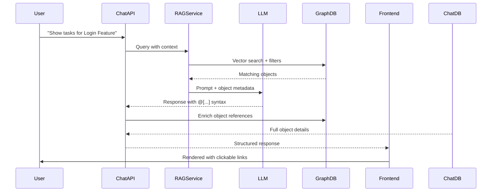

# AI Chat Object References & Mentions

**Version:** 1.0  
**Status:** Design Phase  
**Last Updated:** October 3, 2025

## 1. Overview

Enable the AI chat system to respond with **rich object references** instead of plain text descriptions. When users ask about tasks, requirements, features, or other graph objects, the chat will return interactive "mentions" that link directly to those objects in the system.

### 1.1. Problem Statement

**Current State:**
```
User: "What tasks are assigned to the Login feature?"

AI: "There are 3 tasks assigned to the Login feature:
1. Implement OAuth2 authentication
2. Design login UI mockups
3. Write API documentation for auth endpoints"
```

**Desired State:**
```
User: "What tasks are assigned to the Login feature?"

AI: "There are 3 tasks assigned to @[Login Feature](obj_abc123):
- @[Implement OAuth2 authentication](obj_xyz789) - Status: In Progress
- @[Design login UI mockups](obj_def456) - Status: Done
- @[Write API documentation for auth endpoints](obj_ghi101) - Status: To Do"
```

Users can click any `@[...]` mention to navigate directly to that object.

### 1.2. Use Cases

1. **Task Discovery**
   - "Show me all high priority tasks" → Returns clickable task mentions
   - "What tasks are blocked?" → Links to specific blocked tasks

2. **Requirement Traceability**
   - "What features implement the 'User Authentication' requirement?" → Links to feature objects
   - "Show requirements for the Payment module" → Clickable requirement mentions

3. **Architecture Exploration**
   - "What capabilities are in the Application layer?" → Links to capability objects
   - "Show me all TOGAF principles" → Interactive principle mentions

4. **Relationship Navigation**
   - "What depends on the API Gateway?" → Links to dependent objects
   - "Show stakeholders for Project X" → Clickable stakeholder profiles

5. **Status Queries**
   - "Which features are in progress?" → Links to feature objects with status
   - "Show completed tasks this week" → Clickable task mentions

### 1.3. Key Features

- **Rich Object Mentions**: Structured references with IDs, names, types
- **Interactive Links**: Click to navigate to object detail page
- **Inline Metadata**: Show key properties (status, assignee, priority) in mention
- **Hover Previews**: Tooltip with quick object summary on hover
- **Batch Linking**: Multiple objects referenced in single response
- **Type-aware Rendering**: Different styling/icons per object type
- **Context Preservation**: Maintain conversation context when returning from object
- **Copy Support**: Plain text fallback when copying chat messages

---

## 2. Technical Architecture

### 2.1. Response Format

The AI will return responses in a **structured format** that mixes natural language with object references:

```typescript
interface ChatResponse {
  message_id: string;
  content: string;              // Markdown with object references
  object_references: ObjectReference[];
  metadata: {
    query_type: string;         // 'list', 'search', 'detail', 'relationship'
    total_objects: number;
    has_more: boolean;
  };
}

interface ObjectReference {
  id: string;                   // Graph object ID
  type: string;                 // 'Task', 'Feature', 'Requirement', etc.
  key: string;                  // Human-readable key (e.g., 'FEAT-123')
  name: string;                 // Object name/title
  properties: {                 // Key properties to display inline
    status?: string;
    assignee?: string;
    priority?: string;
    completion_percentage?: number;
    due_date?: string;
  };
  url: string;                  // Deep link to object
  match_score?: number;         // Relevance score from RAG
}
```

### 2.2. Object Reference Syntax

We'll use a **Markdown-inspired syntax** for object references:

```markdown
@[Object Name](object_id)
```

**Examples:**
```markdown
# Simple mention
@[Login Feature](obj_abc123)

# With inline status
@[Implement OAuth2](obj_xyz789) • In Progress

# With multiple properties
@[API Gateway](obj_def456) • Application • Critical Priority

# In a list
- @[Task 1](obj_1) • Done ✓
- @[Task 2](obj_2) • In Progress
- @[Task 3](obj_3) • To Do
```

### 2.3. AI Response Generation Flow



### 2.4. Database Schema Extensions

```sql
-- Store object references per chat message
CREATE TABLE kb.chat_message_references (
  id UUID PRIMARY KEY DEFAULT gen_random_uuid(),
  message_id UUID NOT NULL REFERENCES kb.chat_messages(id) ON DELETE CASCADE,
  object_id UUID NOT NULL REFERENCES kb.graph_objects(id) ON DELETE CASCADE,
  
  -- Reference context
  reference_type TEXT NOT NULL,      -- 'primary', 'related', 'mentioned'
  position_in_message INTEGER,       -- Order of appearance
  match_score DECIMAL(5,4),          -- Relevance score (0-1)
  
  -- Snapshot at reference time (for historical accuracy)
  object_snapshot JSONB NOT NULL,    -- {type, key, name, properties}
  
  created_at TIMESTAMPTZ NOT NULL DEFAULT now()
);

CREATE INDEX idx_message_refs_message ON kb.chat_message_references(message_id);
CREATE INDEX idx_message_refs_object ON kb.chat_message_references(object_id);
CREATE INDEX idx_message_refs_type ON kb.chat_message_references(reference_type);
```

---

## 3. LLM Prompt Engineering

### 3.1. System Prompt Extension

Add to the existing chat system prompt:

```
# Object Reference Instructions

When your response references specific objects from the knowledge base, you MUST use the object reference syntax:

@[Object Name](object_id)

Rules:
1. Always use the exact object_id provided in the context
2. Use the object's canonical name, not a paraphrase
3. Include key properties inline after the mention (status, priority, assignee)
4. Format lists of objects using Markdown list syntax
5. Add relevant emoji/icons for visual scanning (✓ ✗ ⚠️ 🔴 🟡 🟢)

Example Input Context:
```json
{
  "matching_objects": [
    {
      "id": "obj_abc123",
      "type": "Task",
      "key": "TASK-45",
      "name": "Implement OAuth2 authentication",
      "properties": {
        "status": "in_progress",
        "assignee": "john@example.com",
        "priority": "high"
      }
    }
  ]
}
```

Example Response:
"I found 1 task: @[Implement OAuth2 authentication](obj_abc123) • In Progress • High Priority • Assigned to john@example.com"

Always prefer object references over plain text descriptions.
```

### 3.2. Query Classification

Classify user queries to determine response strategy:

```typescript
enum QueryType {
  LIST = 'list',                    // "Show all tasks"
  SEARCH = 'search',                // "Find tasks related to auth"
  DETAIL = 'detail',                // "Tell me about Feature X"
  RELATIONSHIP = 'relationship',    // "What depends on X?"
  STATUS = 'status',                // "What's the status of X?"
  COUNT = 'count',                  // "How many features are done?"
  COMPARISON = 'comparison'         // "Compare X and Y"
}
```

### 3.3. Response Templates by Query Type

#### List Query
```markdown
I found {count} {object_type}s:

- @[Object 1](id_1) • {status} • {priority}
- @[Object 2](id_2) • {status} • {priority}
- @[Object 3](id_3) • {status} • {priority}

{additional_context}
```

#### Relationship Query
```markdown
@[Source Object](id_src) has the following relationships:

**Depends on:**
- @[Dependency 1](id_1) • {type}
- @[Dependency 2](id_2) • {type}

**Used by:**
- @[Consumer 1](id_3) • {type}
```

#### Status Query
```markdown
@[Object Name](id) is currently **{status}**.

**Key Details:**
- Priority: {priority}
- Assignee: {assignee}
- Progress: {percentage}%
- Last updated: {date}

**Related objects:**
- @[Related 1](id_1)
- @[Related 2](id_2)
```

---

## 4. Frontend Implementation

### 4.1. Object Mention Component

```tsx
// apps/admin/src/components/chat/ObjectMention.tsx

interface ObjectMentionProps {
  objectId: string;
  name: string;
  type: string;
  key?: string;
  properties?: Record<string, any>;
  url: string;
  showPreview?: boolean;
}

export function ObjectMention({
  objectId,
  name,
  type,
  key,
  properties,
  url,
  showPreview = true
}: ObjectMentionProps) {
  const [showTooltip, setShowTooltip] = useState(false);
  const { data: preview } = useObjectPreview(objectId, showTooltip);
  
  const typeIcon = getTypeIcon(type);
  const typeColor = getTypeColor(type);
  
  return (
    <a
      href={url}
      className={`
        inline-flex items-center gap-1 px-2 py-0.5 rounded
        bg-${typeColor}-100 hover:bg-${typeColor}-200
        text-${typeColor}-700 hover:text-${typeColor}-900
        border border-${typeColor}-300
        transition-colors cursor-pointer
        no-underline
      `}
      onMouseEnter={() => setShowTooltip(true)}
      onMouseLeave={() => setShowTooltip(false)}
      onClick={(e) => {
        e.preventDefault();
        navigateToObject(url);
      }}
    >
      <Icon name={typeIcon} className="w-3.5 h-3.5" />
      {key && <span className="text-xs font-mono opacity-70">{key}</span>}
      <span className="font-medium">{name}</span>
      
      {showPreview && showTooltip && preview && (
        <ObjectPreviewTooltip preview={preview} />
      )}
    </a>
  );
}
```

### 4.2. Chat Message Renderer

```tsx
// apps/admin/src/components/chat/ChatMessage.tsx

function ChatMessage({ message }: { message: ChatMessage }) {
  const contentWithMentions = useMemo(() => {
    return parseObjectReferences(message.content, message.object_references);
  }, [message]);

  return (
    <div className="chat-message">
      <div className="prose prose-sm max-w-none">
        {contentWithMentions}
      </div>
      
      {message.metadata.has_more && (
        <button
          className="btn btn-sm btn-ghost mt-2"
          onClick={() => loadMoreObjects(message.id)}
        >
          Load more objects...
        </button>
      )}
    </div>
  );
}

function parseObjectReferences(
  content: string,
  references: ObjectReference[]
): ReactNode {
  // Parse @[Name](id) syntax and replace with ObjectMention components
  const parts: ReactNode[] = [];
  let lastIndex = 0;
  
  // Regex to match @[Name](id)
  const mentionRegex = /@\[([^\]]+)\]\(([^)]+)\)/g;
  let match;
  
  while ((match = mentionRegex.exec(content)) !== null) {
    const [fullMatch, name, id] = match;
    const startIndex = match.index;
    
    // Add text before mention
    if (startIndex > lastIndex) {
      parts.push(content.substring(lastIndex, startIndex));
    }
    
    // Find full reference details
    const ref = references.find(r => r.id === id);
    
    if (ref) {
      parts.push(
        <ObjectMention
          key={`${id}-${startIndex}`}
          objectId={ref.id}
          name={ref.name}
          type={ref.type}
          key={ref.key}
          properties={ref.properties}
          url={ref.url}
        />
      );
    } else {
      // Fallback if reference not found
      parts.push(fullMatch);
    }
    
    lastIndex = match.index + fullMatch.length;
  }
  
  // Add remaining text
  if (lastIndex < content.length) {
    parts.push(content.substring(lastIndex));
  }
  
  return <>{parts}</>;
}
```

### 4.3. Object Preview Tooltip

```tsx
// apps/admin/src/components/chat/ObjectPreviewTooltip.tsx

interface ObjectPreview {
  id: string;
  type: string;
  name: string;
  description?: string;
  properties: Record<string, any>;
  relationships: {
    count: number;
    types: string[];
  };
  last_updated: string;
}

export function ObjectPreviewTooltip({ preview }: { preview: ObjectPreview }) {
  return (
    <div className="absolute z-50 w-80 p-4 bg-base-100 shadow-lg rounded-lg border">
      <div className="flex items-start gap-3 mb-3">
        <div className={`w-10 h-10 rounded flex items-center justify-center bg-${getTypeColor(preview.type)}-100`}>
          <Icon name={getTypeIcon(preview.type)} className="w-5 h-5" />
        </div>
        <div className="flex-1 min-w-0">
          <div className="font-semibold truncate">{preview.name}</div>
          <div className="text-xs text-base-content/70">{preview.type}</div>
        </div>
      </div>
      
      {preview.description && (
        <p className="text-sm text-base-content/80 mb-3 line-clamp-3">
          {preview.description}
        </p>
      )}
      
      <div className="space-y-1.5 mb-3">
        {preview.properties.status && (
          <PropertyRow 
            label="Status" 
            value={preview.properties.status}
            badge
          />
        )}
        {preview.properties.priority && (
          <PropertyRow 
            label="Priority" 
            value={preview.properties.priority}
            badge
          />
        )}
        {preview.properties.assignee && (
          <PropertyRow 
            label="Assignee" 
            value={preview.properties.assignee}
          />
        )}
      </div>
      
      <div className="flex items-center justify-between text-xs text-base-content/60 pt-3 border-t">
        <span>{preview.relationships.count} relationships</span>
        <span>Updated {formatRelative(preview.last_updated)}</span>
      </div>
      
      <div className="mt-3">
        <a
          href={`/admin/graph/objects/${preview.id}`}
          className="btn btn-xs btn-primary btn-block"
        >
          Open Object →
        </a>
      </div>
    </div>
  );
}

function PropertyRow({ 
  label, 
  value, 
  badge = false 
}: { 
  label: string; 
  value: string; 
  badge?: boolean;
}) {
  return (
    <div className="flex items-center justify-between text-sm">
      <span className="text-base-content/70">{label}:</span>
      {badge ? (
        <span className="badge badge-sm">{value}</span>
      ) : (
        <span className="font-medium">{value}</span>
      )}
    </div>
  );
}
```

### 4.4. Type Styling

```typescript
// apps/admin/src/lib/objectStyles.ts

export function getTypeIcon(type: string): string {
  const icons: Record<string, string> = {
    Task: 'check-square',
    Feature: 'package',
    Requirement: 'file-text',
    Capability: 'zap',
    Component: 'box',
    Interface: 'link',
    Stakeholder: 'user',
    Vision: 'eye',
    Principle: 'compass',
    Constraint: 'lock',
    Risk: 'alert-triangle',
    Decision: 'git-branch'
  };
  
  return icons[type] || 'circle';
}

export function getTypeColor(type: string): string {
  const colors: Record<string, string> = {
    Task: 'blue',
    Feature: 'purple',
    Requirement: 'green',
    Capability: 'yellow',
    Component: 'orange',
    Interface: 'cyan',
    Stakeholder: 'pink',
    Vision: 'indigo',
    Principle: 'teal',
    Constraint: 'red',
    Risk: 'amber',
    Decision: 'lime'
  };
  
  return colors[type] || 'gray';
}
```

---

## 5. Backend Implementation

### 5.1. Chat Service Extensions

```typescript
// apps/server/src/modules/chat/chat.service.ts

@Injectable()
export class ChatService {
  constructor(
    private readonly ragService: RAGService,
    private readonly graphService: GraphService,
    private readonly llmService: LLMService
  ) {}

  async generateResponse(
    conversationId: string,
    userMessage: string,
    context: ChatContext
  ): Promise<ChatResponse> {
    // 1. RAG: Find relevant objects
    const ragResults = await this.ragService.query({
      query: userMessage,
      filters: {
        project_id: context.project_id,
        branch_id: context.branch_id
      },
      limit: 20
    });
    
    // 2. Enrich with object metadata
    const objectsMetadata = await this.enrichObjectsForPrompt(ragResults.objects);
    
    // 3. Build prompt with object references
    const prompt = this.buildPromptWithObjects(
      userMessage,
      objectsMetadata,
      context
    );
    
    // 4. Get LLM response
    const llmResponse = await this.llmService.generate(prompt);
    
    // 5. Parse object references from response
    const { content, references } = this.parseObjectReferences(
      llmResponse,
      objectsMetadata
    );
    
    // 6. Enrich references with full object data
    const enrichedReferences = await this.enrichReferences(references);
    
    // 7. Store message with references
    const message = await this.saveMessage({
      conversation_id: conversationId,
      role: 'assistant',
      content,
      object_references: enrichedReferences
    });
    
    return {
      message_id: message.id,
      content,
      object_references: enrichedReferences,
      metadata: {
        query_type: this.classifyQuery(userMessage),
        total_objects: enrichedReferences.length,
        has_more: ragResults.total > 20
      }
    };
  }

  private async enrichObjectsForPrompt(
    objects: GraphObject[]
  ): Promise<ObjectMetadata[]> {
    return Promise.all(
      objects.map(async (obj) => ({
        id: obj.id,
        type: obj.type,
        key: obj.key,
        name: obj.properties.name || obj.key,
        properties: {
          status: obj.properties.status,
          assignee: obj.properties.assignee,
          priority: obj.properties.priority,
          completion_percentage: obj.properties.completion_percentage,
          due_date: obj.properties.due_date
        },
        description: obj.properties.description,
        match_score: obj.match_score
      }))
    );
  }

  private buildPromptWithObjects(
    userMessage: string,
    objects: ObjectMetadata[],
    context: ChatContext
  ): string {
    return `
User Question: "${userMessage}"

Relevant Objects from Knowledge Base:
${JSON.stringify(objects, null, 2)}

Instructions:
- Reference objects using @[Name](object_id) syntax
- Include key properties inline (status, priority, assignee)
- Use Markdown formatting for lists and emphasis
- Provide context beyond just listing objects

Response:`;
  }

  private parseObjectReferences(
    response: string,
    metadata: ObjectMetadata[]
  ): { content: string; references: ObjectReference[] } {
    const references: ObjectReference[] = [];
    const mentionRegex = /@\[([^\]]+)\]\(([^)]+)\)/g;
    let match;
    
    while ((match = mentionRegex.exec(response)) !== null) {
      const [, name, id] = match;
      const meta = metadata.find(m => m.id === id);
      
      if (meta) {
        references.push({
          id: meta.id,
          type: meta.type,
          key: meta.key,
          name: meta.name,
          properties: meta.properties,
          url: `/admin/graph/objects/${meta.id}`,
          match_score: meta.match_score
        });
      }
    }
    
    return { content: response, references };
  }

  private async enrichReferences(
    references: ObjectReference[]
  ): Promise<ObjectReference[]> {
    // Fetch full object data for any missing details
    const objectIds = references.map(r => r.id);
    const fullObjects = await this.graphService.getByIds(objectIds);
    
    return references.map(ref => {
      const fullObj = fullObjects.find(o => o.id === ref.id);
      if (fullObj) {
        return {
          ...ref,
          properties: {
            ...ref.properties,
            ...this.extractRelevantProperties(fullObj)
          }
        };
      }
      return ref;
    });
  }

  private async saveMessage(data: {
    conversation_id: string;
    role: string;
    content: string;
    object_references: ObjectReference[];
  }): Promise<ChatMessage> {
    // Save message
    const message = await this.db.query(`
      INSERT INTO kb.chat_messages (conversation_id, role, content)
      VALUES ($1, $2, $3)
      RETURNING *
    `, [data.conversation_id, data.role, data.content]);
    
    // Save references
    if (data.object_references.length > 0) {
      await this.db.query(`
        INSERT INTO kb.chat_message_references 
        (message_id, object_id, reference_type, position_in_message, match_score, object_snapshot)
        VALUES ${data.object_references.map((ref, idx) => 
          `($1, '${ref.id}', 'primary', ${idx}, ${ref.match_score || 0}, '${JSON.stringify({
            type: ref.type,
            key: ref.key,
            name: ref.name,
            properties: ref.properties
          })}'::jsonb)`
        ).join(', ')}
      `, [message.rows[0].id]);
    }
    
    return message.rows[0];
  }

  private classifyQuery(query: string): string {
    const patterns = {
      list: /\b(show|list|get|find all|what are)\b/i,
      search: /\b(find|search|look for)\b/i,
      detail: /\b(tell me about|what is|describe|explain)\b/i,
      relationship: /\b(depends on|related to|connected to|uses|implements)\b/i,
      status: /\b(status|progress|state)\b/i,
      count: /\b(how many|count|number of)\b/i
    };
    
    for (const [type, pattern] of Object.entries(patterns)) {
      if (pattern.test(query)) return type;
    }
    
    return 'general';
  }
}
```

### 5.2. Object Preview API

```typescript
// apps/server/src/modules/graph/graph.controller.ts

@Controller('api/v1/graph/objects')
export class GraphObjectsController {
  @Get(':id/preview')
  @UseGuards(AuthGuard)
  async getObjectPreview(
    @Param('id') id: string,
    @CurrentUser() user: User
  ): Promise<ObjectPreview> {
    const object = await this.graphService.getById(id);
    
    if (!object) {
      throw new NotFoundException('Object not found');
    }
    
    // Get relationship counts
    const relationshipCounts = await this.graphService.getRelationshipCounts(id);
    
    return {
      id: object.id,
      type: object.type,
      key: object.key,
      name: object.properties.name || object.key,
      description: object.properties.description,
      properties: {
        status: object.properties.status,
        priority: object.properties.priority,
        assignee: object.properties.assignee,
        completion_percentage: object.properties.completion_percentage
      },
      relationships: {
        count: relationshipCounts.total,
        types: relationshipCounts.types
      },
      last_updated: object.updated_at
    };
  }
}
```

---

## 6. Copy/Paste Support

### 6.1. Plain Text Fallback

When users copy chat messages, provide clean plain text:

```typescript
// apps/admin/src/components/chat/ChatMessage.tsx

function ChatMessage({ message }: { message: ChatMessage }) {
  const handleCopy = useCallback(() => {
    // Convert object mentions to plain text
    const plainText = message.content.replace(
      /@\[([^\]]+)\]\(([^)]+)\)/g,
      (_, name, id) => {
        const ref = message.object_references.find(r => r.id === id);
        return ref?.key ? `${name} (${ref.key})` : name;
      }
    );
    
    navigator.clipboard.writeText(plainText);
    toast.success('Copied to clipboard');
  }, [message]);

  return (
    <div className="chat-message group relative">
      <button
        className="absolute top-2 right-2 opacity-0 group-hover:opacity-100 btn btn-xs btn-ghost"
        onClick={handleCopy}
      >
        <Icon name="copy" />
      </button>
      {/* ... message content ... */}
    </div>
  );
}
```

**Example Copy Output:**
```
I found 3 tasks assigned to Login Feature (FEAT-123):
- Implement OAuth2 authentication (TASK-45) • In Progress
- Design login UI mockups (TASK-46) • Done
- Write API documentation for auth endpoints (TASK-47) • To Do
```

---

## 7. Navigation & Context Preservation

### 7.1. Deep Linking

When user clicks an object mention:

```typescript
function navigateToObject(url: string) {
  const currentUrl = window.location.pathname;
  
  // Store chat context in session
  sessionStorage.setItem('chat_return_url', currentUrl);
  sessionStorage.setItem('chat_scroll_position', window.scrollY.toString());
  
  // Navigate to object
  window.location.href = url;
}
```

### 7.2. Return to Chat

On object detail pages, show "Return to Chat" breadcrumb:

```tsx
// apps/admin/src/components/layout/Breadcrumb.tsx

export function Breadcrumb() {
  const returnUrl = sessionStorage.getItem('chat_return_url');
  
  if (!returnUrl || !returnUrl.includes('/chat')) {
    return <StandardBreadcrumb />;
  }
  
  return (
    <div className="breadcrumbs text-sm">
      <ul>
        <li>
          <a 
            href={returnUrl}
            onClick={(e) => {
              e.preventDefault();
              navigateBack();
            }}
          >
            <Icon name="message-circle" />
            Return to Chat
          </a>
        </li>
        <li>
          <span className="text-base-content/70">Object Detail</span>
        </li>
      </ul>
    </div>
  );
}

function navigateBack() {
  const returnUrl = sessionStorage.getItem('chat_return_url');
  const scrollPosition = sessionStorage.getItem('chat_scroll_position');
  
  window.location.href = returnUrl;
  
  // Restore scroll position after navigation
  setTimeout(() => {
    window.scrollTo(0, parseInt(scrollPosition || '0'));
  }, 100);
  
  sessionStorage.removeItem('chat_return_url');
  sessionStorage.removeItem('chat_scroll_position');
}
```

---

## 8. Advanced Features

### 8.1. Inline Object Actions

Allow quick actions on object mentions without leaving chat:

```tsx
function ObjectMention({ objectId, name, type }: ObjectMentionProps) {
  const [showActions, setShowActions] = useState(false);
  
  return (
    <div className="relative inline-block">
      <a className="object-mention" /* ... */>
        {name}
      </a>
      
      {showActions && (
        <div className="absolute z-50 mt-1 bg-base-100 shadow-lg rounded-lg border p-2">
          <button className="btn btn-xs btn-ghost w-full justify-start">
            <Icon name="eye" /> View
          </button>
          <button className="btn btn-xs btn-ghost w-full justify-start">
            <Icon name="edit" /> Edit
          </button>
          <button className="btn btn-xs btn-ghost w-full justify-start">
            <Icon name="copy" /> Copy Link
          </button>
          <button className="btn btn-xs btn-ghost w-full justify-start">
            <Icon name="share" /> Share
          </button>
        </div>
      )}
    </div>
  );
}
```

### 8.2. Object Grouping

Group related objects in chat responses:

```markdown
I found 12 objects related to "Authentication":

**Features** (3)
- @[User Login](obj_1) • In Progress
- @[SSO Integration](obj_2) • Planning
- @[Password Reset](obj_3) • Done

**Requirements** (5)
- @[REQ-001: Secure Authentication](obj_4)
- @[REQ-002: Multi-factor Auth](obj_5)
...

**Tasks** (4)
- @[Implement OAuth2](obj_6) • High Priority
...
```

### 8.3. Relationship Visualization

For relationship queries, show mini relationship graph:

```tsx
function RelationshipResponse({ message }: Props) {
  const { sourceObject, relationships } = parseRelationshipData(message);
  
  return (
    <div>
      <p>{message.content}</p>
      
      <div className="my-4 p-4 bg-base-200 rounded-lg">
        <MiniRelationshipGraph
          source={sourceObject}
          relationships={relationships}
        />
      </div>
    </div>
  );
}
```

### 8.4. Batch Operations

Allow selecting multiple object mentions for batch actions:

```tsx
function ChatMessage({ message }: Props) {
  const [selectedObjects, setSelectedObjects] = useState<Set<string>>(new Set());
  
  return (
    <div>
      {selectedObjects.size > 0 && (
        <div className="sticky top-0 bg-primary text-primary-content p-2 rounded-lg mb-2">
          <span>{selectedObjects.size} objects selected</span>
          <button className="btn btn-xs ml-2">Export</button>
          <button className="btn btn-xs ml-2">Add to Collection</button>
          <button className="btn btn-xs ml-2">Clear</button>
        </div>
      )}
      
      {/* Render message with selectable mentions */}
    </div>
  );
}
```

---

## 9. Performance Optimization

### 9.1. Object Preview Caching

```typescript
// apps/admin/src/hooks/useObjectPreview.ts

const previewCache = new Map<string, ObjectPreview>();

export function useObjectPreview(objectId: string, enabled: boolean) {
  return useQuery({
    queryKey: ['object-preview', objectId],
    queryFn: async () => {
      // Check cache first
      if (previewCache.has(objectId)) {
        return previewCache.get(objectId);
      }
      
      const preview = await api.get(`/graph/objects/${objectId}/preview`);
      previewCache.set(objectId, preview);
      
      return preview;
    },
    enabled,
    staleTime: 5 * 60 * 1000, // 5 minutes
    cacheTime: 30 * 60 * 1000  // 30 minutes
  });
}
```

### 9.2. Lazy Loading

For responses with many objects, implement pagination:

```typescript
async function generateResponse(query: string, context: ChatContext) {
  const allObjects = await this.ragService.query(query);
  
  // Return first 10, provide "load more" functionality
  const initialObjects = allObjects.slice(0, 10);
  
  return {
    content: this.formatResponse(initialObjects),
    object_references: this.enrichReferences(initialObjects),
    metadata: {
      total_objects: allObjects.length,
      has_more: allObjects.length > 10,
      next_page_token: allObjects.length > 10 ? 
        this.encodePageToken({ offset: 10, query }) : null
    }
  };
}
```

### 9.3. Debounced Hover Previews

```typescript
function ObjectMention({ objectId }: Props) {
  const [debouncedHover, setDebouncedHover] = useState(false);
  
  useEffect(() => {
    if (isHovering) {
      const timer = setTimeout(() => setDebouncedHover(true), 500);
      return () => clearTimeout(timer);
    } else {
      setDebouncedHover(false);
    }
  }, [isHovering]);
  
  const { data: preview } = useObjectPreview(objectId, debouncedHover);
  
  // ...
}
```

---

## 10. Testing Strategy

### 10.1. Unit Tests

```typescript
describe('ChatService - Object References', () => {
  it('should parse object references from LLM response', () => {
    const response = 'I found @[Task 1](obj_1) and @[Task 2](obj_2)';
    const metadata = [
      { id: 'obj_1', type: 'Task', key: 'TASK-1', name: 'Task 1' },
      { id: 'obj_2', type: 'Task', key: 'TASK-2', name: 'Task 2' }
    ];
    
    const { references } = service.parseObjectReferences(response, metadata);
    
    expect(references).toHaveLength(2);
    expect(references[0].id).toBe('obj_1');
    expect(references[1].id).toBe('obj_2');
  });
  
  it('should handle malformed references gracefully', () => {
    const response = '@[Invalid](missing_id)';
    const metadata = [];
    
    const { references } = service.parseObjectReferences(response, metadata);
    
    expect(references).toHaveLength(0);
  });
  
  it('should classify query types correctly', () => {
    expect(service.classifyQuery('Show all tasks')).toBe('list');
    expect(service.classifyQuery('What depends on X?')).toBe('relationship');
    expect(service.classifyQuery('What is the status?')).toBe('status');
  });
});
```

### 10.2. Integration Tests

```typescript
describe('Chat with Object References - E2E', () => {
  it('should return object references in chat response', async () => {
    const response = await request(app.getHttpServer())
      .post('/api/v1/chat/conversations/conv_1/messages')
      .send({ content: 'Show tasks for Login Feature' })
      .expect(200);
    
    expect(response.body.object_references).toBeDefined();
    expect(response.body.object_references.length).toBeGreaterThan(0);
    expect(response.body.content).toContain('@[');
  });
  
  it('should store message references in database', async () => {
    await request(app.getHttpServer())
      .post('/api/v1/chat/conversations/conv_1/messages')
      .send({ content: 'Show all features' });
    
    const refs = await db.query(
      'SELECT * FROM kb.chat_message_references WHERE message_id = $1',
      [messageId]
    );
    
    expect(refs.rows.length).toBeGreaterThan(0);
  });
});
```

### 10.3. Frontend Tests

```typescript
describe('ObjectMention Component', () => {
  it('should render with correct styling based on type', () => {
    render(
      <ObjectMention
        objectId="obj_1"
        name="Test Task"
        type="Task"
        url="/objects/obj_1"
      />
    );
    
    expect(screen.getByText('Test Task')).toBeInTheDocument();
    expect(screen.getByRole('link')).toHaveAttribute('href', '/objects/obj_1');
  });
  
  it('should show preview on hover', async () => {
    const { user } = render(<ObjectMention {...props} />);
    
    await user.hover(screen.getByText('Test Task'));
    
    await waitFor(() => {
      expect(screen.getByText('Preview Title')).toBeInTheDocument();
    });
  });
});
```

---

## 11. Security Considerations

### 11.1. Authorization

Ensure users can only see objects they have access to:

```typescript
async enrichReferences(references: ObjectReference[], userId: string) {
  // Filter out objects user doesn't have access to
  const accessibleObjects = await this.authService.filterByAccess(
    references.map(r => r.id),
    userId
  );
  
  return references.filter(r => accessibleObjects.includes(r.id));
}
```

### 11.2. XSS Prevention

Sanitize object names before rendering:

```typescript
function ObjectMention({ name }: Props) {
  const sanitizedName = DOMPurify.sanitize(name);
  
  return <a>{sanitizedName}</a>;
}
```

### 11.3. Rate Limiting

Prevent abuse of preview API:

```typescript
@UseGuards(ThrottlerGuard)
@Throttle(100, 60) // 100 requests per minute
@Get(':id/preview')
async getObjectPreview() {
  // ...
}
```

---

## 12. Analytics & Monitoring

### 12.1. Track Object Reference Clicks

```typescript
function ObjectMention({ objectId, url }: Props) {
  const handleClick = (e: React.MouseEvent) => {
    e.preventDefault();
    
    // Track click
    analytics.track('chat_object_reference_clicked', {
      object_id: objectId,
      object_type: type,
      conversation_id: conversationId
    });
    
    navigateToObject(url);
  };
  
  return <a onClick={handleClick}>{name}</a>;
}
```

### 12.2. Monitor Reference Accuracy

```sql
-- Query to analyze reference accuracy
SELECT 
  DATE_TRUNC('day', created_at) as date,
  COUNT(*) as total_references,
  COUNT(*) FILTER (WHERE match_score > 0.8) as high_confidence,
  AVG(match_score) as avg_score
FROM kb.chat_message_references
WHERE created_at > NOW() - INTERVAL '30 days'
GROUP BY date
ORDER BY date DESC;
```

---

## 13. Implementation Timeline

### Phase 1: Core Object Reference System (8-10 hours)
- Database schema for message references
- LLM prompt engineering for @[...] syntax
- Backend parsing and enrichment logic
- Basic REST API for object previews
- Unit tests

### Phase 2: Frontend Components (10-12 hours)
- ObjectMention component with styling
- Chat message parser for reference syntax
- Object preview tooltip
- Type-specific icons and colors
- Click navigation with context preservation

### Phase 3: Advanced Features (8-10 hours)
- Hover preview with caching
- Copy/paste plain text fallback
- Keyboard shortcuts (Cmd+Click for new tab)
- Inline quick actions
- Return-to-chat breadcrumb

### Phase 4: Performance & Polish (6-8 hours)
- Preview caching and lazy loading
- Debounced hover loading
- Batch operations UI
- Error handling and fallbacks
- Accessibility improvements

### Phase 5: Testing & Documentation (4-6 hours)
- Integration tests
- E2E tests with Playwright
- Analytics instrumentation
- User documentation
- Developer API docs

**Total Estimated Effort:** 36-46 hours

---

## 14. Success Metrics

1. **Engagement**
   - % of chat responses containing object references
   - Click-through rate on object mentions
   - Average time to navigate back to chat

2. **Accuracy**
   - % of references with match_score > 0.8
   - User feedback on reference relevance
   - Error rate (404s, broken references)

3. **Performance**
   - Preview load time (target: <200ms)
   - Chat response time with references (target: <2s)
   - Cache hit rate (target: >70%)

4. **User Satisfaction**
   - Reduction in "show me X" follow-up queries
   - NPS score for chat feature
   - Support tickets related to navigation

---

## 15. Future Enhancements

1. **Smart Reference Grouping**: Automatically group similar objects in responses
2. **Reference Suggestions**: Auto-complete object names as user types
3. **Visual Relationship Maps**: Show mini graph when mentioning related objects
4. **Object Comparison**: Side-by-side comparison of mentioned objects
5. **Bulk Export**: Export all referenced objects to CSV/JSON
6. **Reference History**: Track which objects user explores most via chat
7. **Natural Language Mentions**: Support varied syntax (e.g., "Login Feature (FEAT-123)")
8. **Cross-Project References**: Link to objects in other projects with permission

---

## 16. Related Specifications

- [AI Chat System](./12-ai-chat.md) - Core chat functionality
- [Dynamic Object Graph](./19-dynamic-object-graph.md) - Graph object schema
- [Admin Notification Inbox](./35-admin-notification-inbox.md) - Similar mention pattern
- [Graph Search & Pagination](./graph-search-pagination.md) - Object discovery

---

## 17. Next Steps

1. **Prototype LLM prompt** with object reference syntax
2. **Build ObjectMention component** in Storybook
3. **Implement backend parsing** and enrichment
4. **Create chat message fixtures** for testing
5. **User testing** with real queries and objects
6. **Iterate based on feedback**

This feature will transform the chat experience from passive Q&A into an **active exploration tool**, allowing users to seamlessly navigate their knowledge graph while conversing with AI. 🚀
