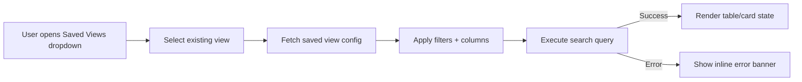

# Object Browser & Dynamic Filtering System

**Version:** 1.0  
**Status:** Design Phase  
**Last Updated:** October 3, 2025

## 1. Overview

Provide a powerful, schema-aware Object Browser that lets users explore all graph objects (Tasks, Features, Requirements, Capabilities, Stakeholders, etc.) with:
- Dynamic filters that adapt to the selected object type
- Fast, incremental search (text + semantic + property filters)
- Flexible result presentation (table, cards, relationships, graph)
- Saved views / presets ("My Open Tasks", "High-Risk Requirements")
- Bulk actions and inline editing for speed

The browser becomes the central operational console for navigating the knowledge graph.

---

## 2. Core Goals

| Goal | Description | KPI |
|------|-------------|-----|
| Dynamic Filtering | Auto-generate filters based on object type schema (properties, labels, relationships) | Filter load < 150ms |
| High Performance | Return first page of results fast, even on large datasets | P95 query < 800ms |
| Flexible Views | Switch between table / cards / graph / relationship matrix | View switch < 200ms |
| Saved Views | Allow naming & sharing parameterized queries | 5+ saved views per active user |
| High Usability | Reduce manual typing and guesswork | 30% reduction in follow-up searches |

---

## 3. Key Features

### 3.1. Filtering & Query Construction
- Type selector (multi-type OR single-type mode)
- Universal quick filter (search across name, key, description)
- Dynamic property filters (string, enum, number, boolean, tag, date range)
- Relationship filters ("has children", "depends_on Feature", "used_by > 3 components")
- Label filters (with frequency counts)
- Status filters (common statuses across types)
- Source filters (integration provider, external type)
- Temporal filters (created_at, updated_at, last_synced_at)
- Quality filters (confidence_score, review_required, duplication_score)
- AI-assisted natural language filter builder ("show risky features without owner")

### 3.2. Result Views
1. **Table View (default)**
   - Virtualized rows, resizable & reorderable columns
   - Column types auto-detected (badge, progress bar, link, enum color chip)
   - Inline editing for shallow properties (status, priority, owner)
2. **Card View**
   - Compact density vs comfortable density toggle
   - Highlights key metrics (progress %, risk level, dependencies count)
3. **Graph View** (mini relationship context) 
   - Root nodes filtered by query, expandable to 1 hop
4. **Dependency Matrix** (for components/interfaces)
5. **Timeline View** (when filtering by temporal properties) - e.g. requirements over delivery plan

### 3.3. Dynamic Filter Generation
Filters shown depend on selected type(s):
- Shared filters (status, priority, owner, labels)
- Type-specific filters (e.g., Feature: `release_version`, Requirement: `adm_phase`, Risk: `risk_level`, Capability: `maturity_level`)
- Frequency-based ranking (most-used properties surfaced top)
- Collapsible categories: Core / Execution / Governance / Relationships / Source / Quality

### 3.4. Saved Views & Sharing
- Save current filter + column layout + sort + view mode
- Mark favorite views (pinned at top)
- Role-based shared views (team, org, project)
- System-provided default views ("Recently Updated", "Needs Review", "Imported from ClickUp", "Stale > 30d")

### 3.5. Bulk Actions
- Edit (status, label add/remove, assignee)
- Export (CSV / JSON / NDJSON)
- Create relationships ("link all selected to X")
- Move to branch / merge (if supported later)
- Mark reviewed / archive / soft delete

### 3.6. UX Niceties
| Feature | Description | Value |
|---------|-------------|-------|
| Query pills | Each active filter displayed as pill with quick removal | Visual clarity |
| Filter suggestions | Based on recent team usage patterns | Speeds discovery |
| Keyboard palette (⌘K) | Execute saved view / toggle modes | Power user speed |
| Live counts | Show approximate result count while building query | Confidence |
| Debounced query apply | Avoid over-querying backend | Performance |
| Empty state heuristics | Suggest filters to add when 0 results | Retention |
| Change indicators | Highlight objects changed in last session | Awareness |
| Heat badges | Show risk or activity hotspots | Prioritization |
| Inline AI assist | Suggest: "filter to unresolved dependencies" | Time-saving |
| Column density control | Comfortable / Compact / Condensed | Adaptability |
| Multi-sort | Primary & secondary sort indicators | Precision |
| Persisted layout | Local + server-side sync | Continuity |
| Query URL sync | Copy/share a live state deep link | Collaboration |
| Scroll anchor restoration | Keeps position after object view return | Flow |

---

## 4. Data Model & Schema Introspection

### 4.1. Schema Source
Use existing dynamic object model (see `docs/spec/19-dynamic-object-graph.md`). Each object has:
- Core columns: id, type, key, properties(JSONB), labels(TEXT[]), created_at/updated_at
- Derived metadata: relationship counts, quality metrics
- Source block (in properties.source)

### 4.2. Introspection API
```http
GET /api/v1/graph/schema/types
```
Response:
```json
[
  {
    "type": "Feature",
    "display_name": "Feature",
    "icon": "package",
    "primary_name_property": "name",
    "properties": [
      { "name": "status", "type": "enum", "values": ["todo", "in_progress", "done"], "indexed": true },
      { "name": "priority", "type": "enum", "values": ["low", "medium", "high", "critical"], "indexed": true },
      { "name": "release_version", "type": "string" },
      { "name": "progress_percent", "type": "number", "range": [0,100] },
      { "name": "owner", "type": "user" },
      { "name": "confidence_score", "type": "number", "range": [0,1] },
      { "name": "risk_level", "type": "enum", "values": ["low", "medium", "high"] }
    ],
    "relationships": [
      { "name": "implements", "target": "Requirement", "direction": "out" },
      { "name": "depends_on", "target": "Feature", "direction": "out" }
    ]
  }
]
```

### 4.3. Dynamic Filter Derivation Rules
| Source | Filter Type | Example |
|--------|-------------|---------|
| enum property | Multi-select OR chipset | status, priority |
| string property | Text contains / exact / regex (advanced) | owner_email |
| number property | Range slider / min-max input | confidence_score |
| date property | Relative (last 7d / last 30d / custom range) | updated_at |
| boolean property | Toggle / tri-state (true/false/any) | archived |
| labels array | Multi-select with frequency badges | labels |
| relationship count | Numeric filter (> N dependencies) | depends_on_count |
| relationship existence | Has/Has not | has_children |
| source.provider | Multi-select | clickup, manual |
| quality flag | Quick toggle | requires_review |

---

## 5. Search & Query API

### 5.1. Endpoint
```http
POST /api/v1/graph/objects/search
```
Request Body:
```json
{
  "types": ["Feature", "Requirement"],
  "filters": {
    "status": { "op": "in", "values": ["in_progress", "todo"] },
    "priority": { "op": "eq", "value": "high" },
    "confidence_score": { "op": ">=", "value": 0.6 },
    "updated_at": { "op": "between", "from": "2025-09-01", "to": "2025-10-03" },
    "relationships.depends_on.count": { "op": ">", "value": 0 },
    "labels": { "op": "contains_all", "values": ["customer", "backend"] },
    "source.provider": { "op": "eq", "value": "clickup" },
    "review_required": { "op": "eq", "value": true }
  },
  "fulltext": "api gateway latency",
  "sort": [ { "field": "updated_at", "direction": "desc" } ],
  "view": "table",
  "pagination": { "limit": 50, "cursor": null },
  "include": ["relationship_counts", "source", "quality"]
}
```
Response (partial):
```json
{
  "results": [
    {
      "id": "obj_123",
      "type": "Feature",
      "key": "FEAT-102",
      "name": "API Gateway Latency Optimization",
      "properties": {
        "status": "in_progress",
        "priority": "high",
        "progress_percent": 45,
        "owner": "alice",
        "confidence_score": 0.78,
        "risk_level": "medium"
      },
      "relationships": {
        "depends_on_count": 2,
        "implements_count": 3
      },
      "source": { "provider": "clickup", "external_id": "task_abc" },
      "quality": { "review_required": false },
      "updated_at": "2025-10-02T18:21:00Z"
    }
  ],
  "cursor": "eyJvZmZzZXQiOjUwLCJ0b3RhbCI6MTAwMH0=",
  "approx_total": 1000
}
```

### 5.2. Query Execution Strategy
1. Translate filters into SQL WHERE fragments
2. Use GIN indexes on JSONB for frequent properties:
   ```sql
   CREATE INDEX idx_graph_objects_props_gin ON kb.graph_objects USING gin (properties jsonb_path_ops);
   CREATE INDEX idx_graph_objects_labels ON kb.graph_objects USING gin (labels);
   CREATE INDEX idx_graph_objects_type ON kb.graph_objects(type);
   CREATE INDEX idx_graph_objects_updated_at ON kb.graph_objects(updated_at);
   ```
3. Materialized view (optional Phase 2) for aggregated relationship counts
4. Approximate total: use `reltuples` or `COUNT(*) FILTER (LIMIT 5000)` heuristic
5. Cursor-based pagination (stable sort fallback: (updated_at, id))

### 5.3. Filter Safety & Validation
- Block expensive regex on large fields unless explicit advanced mode
- Enforce max disjunction size (e.g., 50 values in IN)
- Auto-collapse redundant filters (status eq vs in [status])

---

## 6. Frontend Architecture

### 6.1. Component Layout
```
┌──────────────────────────────────────────────┐
│ Toolbar: Type Selector | Quick Search | View │
├──────────────────────────────────────────────┤
│ Filters Sidebar (collapsible)               │
│  - Active Pill Strips                       │
│  - Dynamic Filter Groups                    │
│  - Saved Views Panel                        │
├──────────────────────────────────────────────┤
│ Result Area (Table/Card/Graph)              │
│  - Virtualized rows                         │
│  - Inline metrics                           │
│  - Bulk actions bar (on selection)          │
├──────────────────────────────────────────────┤
│ Footer: Result count | Query time | Cursor  │
└──────────────────────────────────────────────┘
```

### 6.2. State Model
```typescript
interface ObjectBrowserState {
  selectedTypes: string[];
  activeFilters: Record<string, FilterState>;
  quickSearch: string;
  sort: { field: string; direction: 'asc' | 'desc' }[];
  viewMode: 'table' | 'card' | 'graph' | 'matrix' | 'timeline';
  pagination: { cursor: string | null; pageSize: number };
  selectedRows: Set<string>;
  savedViews: SavedViewMeta[];
  schema: TypeSchema[];
  loading: boolean;
  performance: { lastQueryMs: number };
}
```

### 6.3. Table Column Definition
```typescript
interface ColumnDef {
  key: string;
  label: string;
  width: number;
  type: 'text' | 'enum' | 'progress' | 'badge' | 'number' | 'date' | 'user' | 'relationship_count';
  accessor: (row: ObjectRow) => any;
  sortable?: boolean;
  editable?: boolean;
  visible: boolean;
  pinned?: 'left' | 'right';
}
```

### 6.4. Column Auto-Suggestion
Rules:
- Always show: key, name, type, updated_at
- Show up to 3 top frequency enum fields per type
- Show 1 metric numeric field if available (progress, confidence, risk)
- Collapse low-density fields into overflow drawer

### 6.5. Performance Techniques
| Technique | Purpose |
|-----------|---------|
| React Window (virtual rows) | Render large datasets |
| Debounced filter application | Avoid spamming API |
| AbortController | Cancel stale queries |
| Local schema cache | Avoid repeated introspection calls |
| Optimistic inline edits | Snappy updates |
| Query fingerprinting | Reuse cached results |

---

## 7. UX Detail Examples

### 7.1. Filter Pills
```
Type: Feature ×   Status: In Progress ×   Priority: High ×   Provider: ClickUp ×
```

### 7.2. Empty State
```
No results.
• Remove one of: Priority: High, Status: In Progress
• Try adding: Risk Level, Release Version
• Explore Saved View: "All Open Features"
```

### 7.3. Inline Edit
Click status cell → dropdown with transitions + keyboard navigation (↑ ↓ Enter Esc).

### 7.4. Keyboard Shortcuts
| Shortcut | Action |
|----------|--------|
| / | Focus quick search |
| f | Open filter add modal |
| v | Cycle view mode |
| s | Save current view |
| r | Refresh data |
| ⌘A | Select all on page |
| Esc | Clear selection / close overlay |

### 7.5. AI Assist (Future Phase)
Input: "Show high priority features without owners updated in last 14 days" → generated filter set.

---

## 8. Backend Components

### 8.1. Services
- `ObjectSearchService`: builds SQL dynamically with safety
- `SchemaIntrospectionService`: caches + ranks property usage
- `FilterSuggestionService`: logs filter usage frequency → recommends
- `ViewPersistenceService`: CRUD saved views (with ACL)

### 8.2. Saved Views Schema
```sql
CREATE TABLE kb.object_browser_saved_views (
  id UUID PRIMARY KEY DEFAULT gen_random_uuid(),
  project_id UUID NOT NULL,
  user_id UUID NOT NULL,
  name TEXT NOT NULL,
  description TEXT,
  is_shared BOOLEAN DEFAULT false,
  shared_scope TEXT, -- 'project' | 'org' | 'public'
  query JSONB NOT NULL, -- {types, filters, sort, columns, viewMode}
  usage_count INTEGER DEFAULT 0,
  last_used_at TIMESTAMPTZ,
  created_at TIMESTAMPTZ DEFAULT now(),
  updated_at TIMESTAMPTZ DEFAULT now()
);
CREATE INDEX idx_saved_views_project ON kb.object_browser_saved_views(project_id);
CREATE INDEX idx_saved_views_user ON kb.object_browser_saved_views(user_id);
```

### 8.3. Relationship Count Aggregation (Optional Optimization)
Materialized view refreshed every 5m:
```sql
CREATE MATERIALIZED VIEW kb.object_relationship_stats AS
SELECT
  go.id AS object_id,
  COUNT(r.id) FILTER (WHERE r.src_id = go.id) AS outgoing_count,
  COUNT(r.id) FILTER (WHERE r.dst_id = go.id) AS incoming_count,
  COUNT(*) FILTER (WHERE r.type = 'depends_on') AS depends_on_count
FROM kb.graph_objects go
LEFT JOIN kb.graph_relationships r 
  ON r.src_id = go.id OR r.dst_id = go.id
WHERE go.deleted_at IS NULL
GROUP BY go.id;
```

---

## 9. Security & Permissions

| Concern | Strategy |
|---------|----------|
| Object-level access | Filter search results at query time via ACL join or precomputed access table |
| Column leakage | Only return requested fields; sanitize dynamic property keys |
| Filter injection | Strict whitelist for operators + structured JSON only |
| Abuse (heavy queries) | Query cost scoring + deny extremely broad unpaginated requests |
| Data export | Rate limit + audit log large exports |
| Saved views sharing | Scope validation before exposing shared view |

---

## 10. Testing Strategy

### 10.1. Unit
- Filter translation (JSON → SQL fragment)
- Query classification (simple vs complex)
- Schema introspection ranking logic

### 10.2. Integration
- Mixed-type searches
- Large result sets paging correctness
- Access control filtering
- Performance regression (timed tests with EXPLAIN ANALYZE)

### 10.3. E2E (Playwright)
- Create filter → apply → verify row subset
- Save view → reload → state matches
- Inline edit → persisted backend
- Bulk label apply

### 10.4. Load / Perf (Later)
- 500k objects synthetic dataset
- Query latency percentile tracking

---

## 11. Implementation Phases

| Phase | Scope | Est. Hours |
|-------|-------|------------|
| 1 | Core search API + schema introspection + minimal table view | 14-18 |
| 2 | Dynamic filters + pill UI + pagination + saved views (personal) | 12-16 |
| 3 | Shared views + bulk actions + inline edits + performance passes | 12-16 |
| 4 | Additional views (cards, graph mini-view, timeline) | 14-20 |

---

## Appendix A: Saved View Load Flow (Mermaid)



Wireframe Storybook mapping:
- `Wireframes/ObjectBrowser/Table` stories emulate stages E->F (loading, empty, error).
- Future card view stories will supplement render path for alternative visualization.
| 5 | Enhancements (AI assist, suggestions, heat indicators) | 10-14 |
| Total | | 62-84 |

---

## 12. Future Enhancements
- AI: Suggest filters based on past activity or goal prompts
- Cross-branch diffing mode (show delta across branches)
- Temporal snapshots ("as of date" viewing)
- Drift detection: highlight objects diverged from source system
- View subscriptions: receive notifications when view results change size
- Embedding-based semantic clustering of results
- Pivot view (group by status → group by priority)
- Inline relationship creation via row drag & drop

---

## 13. Example User Journeys

### Journey: Prioritizing Review Work
1. Select types: Requirement + Feature
2. Add filter: review_required = true
3. Sort: confidence_score asc
4. Bulk select top 10 → Mark Reviewed
5. Save view as "Pending Review"

### Journey: Investigating Integration Freshness
1. Filter: source.provider = clickup
2. Add filter: last_synced_at < now() - 7d
3. Add column: last_synced_at
4. Bulk trigger re-import (future feature)
5. Export to CSV for audit

### Journey: Release Scoping
1. Filter: type=Feature, release_version = 2025.4
2. Add dependency count > 0
3. Switch to Graph View → Expand dependencies
4. Identify high-risk bottlenecks (risk_level=high)

---

## 14. Metrics & Observability
- Query latency (avg / P95 / P99)
- Filter adoption frequency (which filters used most)
- Saved views creation & reuse rate
- Inline edit success/failure ratio
- Aborted query ratio (helps tune debouncing)
- Bulk action volume & lag

---

## 15. Related Specs
- [19-dynamic-object-graph.md](./19-dynamic-object-graph.md)
- [graph-search-pagination.md](./graph-search-pagination.md)
- [35-admin-notification-inbox.md](./35-admin-notification-inbox.md)
- [36-chat-object-references.md](./36-chat-object-references.md)

---

## 16. Next Steps
1. Approve scope & phased plan
2. Add migration for saved views table
3. Implement Phase 1 (minimal usable version)
4. Usability review with real dataset
5. Iterate on priority of advanced views

---

## 17. Summary
This Object Browser gives power users and architects a **single, high-performance pane** to interrogate, reshape, and triage the knowledge graph. Its dynamic schema-driven filtering, saved operational views, and progressive enhancement path establish it as a core pillar alongside Chat, Notifications, and Integrations.

Ready to proceed with Phase 1 implementation? 🚀
