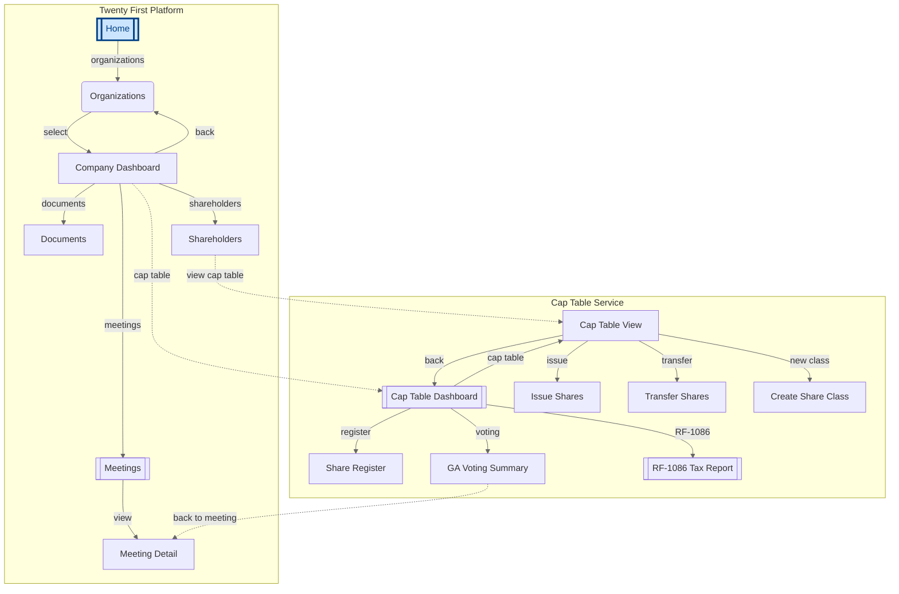
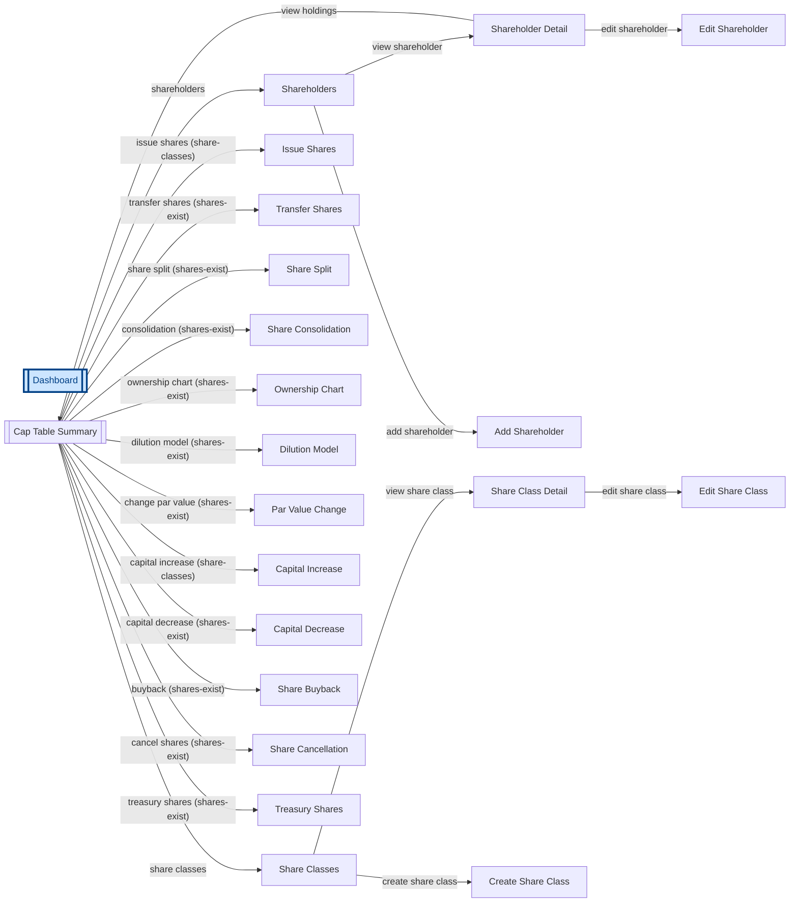

# Navigation Graph Demo: Mermaid Diagrams

## 1. Multi-Service Composition

**Twenty First Platform** imports the **Cap Table** service.
Portal edges (dashed lines) connect contexts across service boundaries.



## 2. 21st-captable: Cap Table Group (LR layout)

Only the captable tab group — 21 contexts with guard annotations.



## 3. 21st-captable: Full Access Reachability

**Green** = reachable with all guards satisfied (109 of 115 contexts).
**Red** = blocked (6 contexts unreachable even with full access — entry point not connected).

Shown with tab-group subgraphs.

```mermaid
graph TD
    subgraph governance["Governance"]
        governance_overview[["Governance Overview"]]
        board_list["Board of Directors"]
        board_member_detail["Board Member Detail"]
        board_member_add["Add Board Member"]
        resolution_list["Resolutions"]
        resolution_detail["Resolution Detail"]
        resolution_create["Create Resolution"]
        voting_round["Voting Round"]
        shareholder_agreement_list["Shareholder Agreements"]
        shareholder_agreement_detail["Agreement Detail"]
        shareholder_agreement_create["Create Agreement"]
        general_meeting["General Meeting"]
        general_meeting_create["Create General Meeting"]
        proxy_voting["Proxy Voting"]
    end
    subgraph equity["Equity"]
        equity_overview[["Equity Overview"]]
        instrument_list["Instruments"]
        instrument_detail["Instrument Detail"]
        instrument_create["Create Instrument"]
        instrument_edit["Edit Instrument"]
        option_plan_list["Option Plans"]
        option_plan_detail["Option Plan Detail"]
        option_plan_create["Create Option Plan"]
        option_grant_list["Option Grants"]
        option_grant_detail["Option Grant Detail"]
        option_grant_create["Create Option Grant"]
        option_exercise["Exercise Options"]
        warrant_list["Warrants"]
        warrant_detail["Warrant Detail"]
        warrant_create["Create Warrant"]
        warrant_exercise["Exercise Warrant"]
        convertible_list["Convertible Notes"]
        convertible_detail["Convertible Note Detail"]
        convertible_create["Create Convertible Note"]
        convertible_convert["Convert Note to Equity"]
        vesting_schedule_list["Vesting Schedules"]
        vesting_schedule_detail["Vesting Schedule Detail"]
        vesting_schedule_create["Create Vesting Schedule"]
        vesting_simulation["Vesting Simulation"]
    end
    subgraph exit["Exit & Liquidity"]
        exit_overview[["Exit Overview"]]
        valuation_history["Valuation History"]
        valuation_create["Record Valuation"]
        waterfall_analysis["Waterfall Analysis"]
        waterfall_scenario["Waterfall Scenario"]
        waterfall_scenario_create["Create Waterfall Scenario"]
        liquidity_event["Liquidity Events"]
        liquidity_event_detail["Liquidity Event Detail"]
        liquidity_event_create["Create Liquidity Event"]
        distribution_plan["Distribution Plan"]
        secondary_sale["Secondary Sale"]
        right_of_first_refusal["Right of First Refusal"]
    end
    subgraph reporting["Reporting"]
        reporting_overview[["Reporting Overview"]]
        shareholder_register_report["Shareholder Register Report"]
        cap_table_snapshot["Cap Table Snapshot"]
        equity_summary_report["Equity Summary Report"]
        transaction_log["Transaction Log"]
        altinn_filing["Altinn Filing"]
        brreg_filing["Brønnøysund Filing"]
        tax_report["Tax Report"]
        annual_statement["Annual Statement"]
        export_pdf["Export PDF"]
        export_csv["Export CSV"]
    end
    subgraph data["Records"]
        data_overview[["Records Overview"]]
        document_list["Documents"]
        document_detail["Document Detail"]
        document_upload["Upload Document"]
        audit_trail["Audit Trail"]
        ledger_entries["Ledger Entries"]
        beneficial_owners["Beneficial Owners"]
        beneficial_owner_detail["Beneficial Owner Detail"]
        import_data["Import Data"]
    end
    subgraph setup["Admin"]
        settings_overview[["Settings"]]
        company_settings["Company Settings"]
        registry_mode["Registry Mode"]
        user_management["User Management"]
        user_invite["Invite User"]
        role_management["Role Management"]
        billing["Billing"]
        subscription["Subscription"]
        api_keys["API Keys"]
        integration_settings["Integrations"]
        company_create("Create Company")
        profile_settings("Profile Settings")
    end
    subgraph overview["Overview"]
        company_list("Organizations")
        company_dashboard[["Company Dashboard"]]
        company_overview["Company Overview"]
        notifications("Notifications")
        activity_feed["Activity Feed"]
    end
    subgraph captable["Cap Table"]
        captable_summary[["Cap Table Summary"]]
        shareholder_list["Shareholders"]
        shareholder_detail["Shareholder Detail"]
        shareholder_create["Add Shareholder"]
        shareholder_edit["Edit Shareholder"]
        share_class_list["Share Classes"]
        share_class_detail["Share Class Detail"]
        create_share_class["Create Share Class"]
        edit_share_class["Edit Share Class"]
        share_issue["Issue Shares"]
        share_transfer["Transfer Shares"]
        share_split["Share Split"]
        share_consolidation["Share Consolidation"]
        ownership_chart["Ownership Chart"]
        dilution_model["Dilution Model"]
        par_value_change["Par Value Change"]
        capital_increase["Capital Increase"]
        capital_decrease["Capital Decrease"]
        share_buyback["Share Buyback"]
        share_cancellation["Share Cancellation"]
        treasury_shares["Treasury Shares"]
    end
    subgraph members["Members"]
        member_list[["Members"]]
        member_detail["Member Detail"]
        member_create["Add Member"]
        member_edit["Edit Member"]
        member_contribution["Member Contribution"]
        membership_transfer["Membership Transfer"]
    end
    global_dashboard[["Dashboard"]]

    global_dashboard -->|organizations| company_list
    global_dashboard -->|notifications| notifications
    global_dashboard -->|profile| profile_settings
    company_list -->|open company| company_dashboard
    company_list -->|create company| company_create
    company_dashboard -->|overview| company_overview
    company_dashboard -->|activity| activity_feed
    company_dashboard -->|cap table| captable_summary
    captable_summary -->|shareholders| shareholder_list
    shareholder_list -->|view shareholder| shareholder_detail
    shareholder_list -->|add shareholder| shareholder_create
    shareholder_detail -->|edit shareholder| shareholder_edit
    captable_summary -->|share classes| share_class_list
    share_class_list -->|view share class| share_class_detail
    share_class_list -->|create share class| create_share_class
    share_class_detail -->|edit share class| edit_share_class
    captable_summary -->|issue shares| share_issue
    captable_summary -->|transfer shares| share_transfer
    captable_summary -->|share split| share_split
    captable_summary -->|consolidation| share_consolidation
    captable_summary -->|ownership chart| ownership_chart
    captable_summary -->|dilution model| dilution_model
    captable_summary -->|change par value| par_value_change
    captable_summary -->|capital increase| capital_increase
    captable_summary -->|capital decrease| capital_decrease
    captable_summary -->|buyback| share_buyback
    captable_summary -->|cancel shares| share_cancellation
    captable_summary -->|treasury shares| treasury_shares
    company_dashboard -->|members| member_list
    member_list -->|view member| member_detail
    member_list -->|add member| member_create
    member_detail -->|edit member| member_edit
    member_detail -->|record contribution| member_contribution
    member_list -->|transfer membership| membership_transfer
    company_dashboard -->|equity| equity_overview
    equity_overview -->|instruments| instrument_list
    instrument_list -->|view instrument| instrument_detail
    instrument_list -->|create instrument| instrument_create
    instrument_detail -->|edit instrument| instrument_edit
    equity_overview -->|option plans| option_plan_list
    option_plan_list -->|view plan| option_plan_detail
    option_plan_list -->|create plan| option_plan_create
    option_plan_detail -->|view grants| option_grant_list
    option_grant_list -->|view grant| option_grant_detail
    option_grant_list -->|create grant| option_grant_create
    option_grant_detail -->|exercise options| option_exercise
    equity_overview -->|warrants| warrant_list
    warrant_list -->|view warrant| warrant_detail
    warrant_list -->|create warrant| warrant_create
    warrant_detail -->|exercise warrant| warrant_exercise
    equity_overview -->|convertible notes| convertible_list
    convertible_list -->|view note| convertible_detail
    convertible_list -->|create note| convertible_create
    convertible_detail -->|convert to equity| convertible_convert
    equity_overview -->|vesting schedules| vesting_schedule_list
    vesting_schedule_list -->|view schedule| vesting_schedule_detail
    vesting_schedule_list -->|create schedule| vesting_schedule_create
    vesting_schedule_detail -->|simulate vesting| vesting_simulation
    company_dashboard -->|exit & liquidity| exit_overview
    exit_overview -->|valuations| valuation_history
    valuation_history -->|record valuation| valuation_create
    exit_overview -->|waterfall| waterfall_analysis
    waterfall_analysis -->|view scenario| waterfall_scenario
    waterfall_analysis -->|create scenario| waterfall_scenario_create
    exit_overview -->|liquidity events| liquidity_event
    liquidity_event -->|view event| liquidity_event_detail
    liquidity_event -->|create event| liquidity_event_create
    liquidity_event_detail -->|distribution plan| distribution_plan
    exit_overview -->|secondary sale| secondary_sale
    exit_overview -->|right of first refusal| right_of_first_refusal
    company_dashboard -->|governance| governance_overview
    governance_overview -->|board| board_list
    board_list -->|view member| board_member_detail
    board_list -->|add member| board_member_add
    governance_overview -->|resolutions| resolution_list
    resolution_list -->|view resolution| resolution_detail
    resolution_list -->|create resolution| resolution_create
    resolution_detail -->|start voting| voting_round
    governance_overview -->|agreements| shareholder_agreement_list
    shareholder_agreement_list -->|view agreement| shareholder_agreement_detail
    shareholder_agreement_list -->|create agreement| shareholder_agreement_create
    governance_overview -->|general meeting| general_meeting
    governance_overview -->|create meeting| general_meeting_create
    general_meeting -->|proxy voting| proxy_voting
    company_dashboard -->|reporting| reporting_overview
    reporting_overview -->|shareholder register| shareholder_register_report
    reporting_overview -->|cap table snapshot| cap_table_snapshot
    reporting_overview -->|equity summary| equity_summary_report
    reporting_overview -->|transaction log| transaction_log
    reporting_overview -->|altinn filing| altinn_filing
    reporting_overview -->|brønnøysund filing| brreg_filing
    reporting_overview -->|tax report| tax_report
    reporting_overview -->|annual statement| annual_statement
    reporting_overview -->|export PDF| export_pdf
    reporting_overview -->|export CSV| export_csv
    company_dashboard -->|records| data_overview
    data_overview -->|documents| document_list
    document_list -->|view document| document_detail
    document_list -->|upload document| document_upload
    data_overview -->|audit trail| audit_trail
    data_overview -->|ledger entries| ledger_entries
    data_overview -->|beneficial owners| beneficial_owners
    beneficial_owners -->|view owner| beneficial_owner_detail
    data_overview -->|import data| import_data
    company_dashboard -->|settings| settings_overview
    settings_overview -->|company settings| company_settings
    settings_overview -->|registry mode| registry_mode
    settings_overview -->|users| user_management
    user_management -->|invite user| user_invite
    settings_overview -->|roles| role_management
    settings_overview -->|billing| billing
    billing -->|subscription| subscription
    settings_overview -->|API keys| api_keys
    settings_overview -->|integrations| integration_settings
    shareholder_detail -->|view holdings| captable_summary
    captable_summary -->|equity instruments| equity_overview
    captable_summary -->|exit planning| exit_overview
    ownership_chart -->|waterfall analysis| waterfall_analysis
    shareholder_detail -->|agreements| shareholder_agreement_list
    option_grant_detail -->|view shareholder| shareholder_detail
    transaction_log -->|view shareholder| shareholder_detail
    transaction_log -->|view instrument| instrument_detail
    audit_trail -->|view transactions| transaction_log
    dilution_model -->|view instruments| instrument_list
    vesting_schedule_detail -->|linked grants| option_grant_list
    captable_summary -->|governance| governance_overview
    shareholder_detail -->|voting history| resolution_list
    equity_overview -->|reporting| reporting_overview
    captable_summary -->|reports| reporting_overview
    waterfall_analysis -->|back to cap table| captable_summary
    governance_overview -->|cap table| captable_summary
    beneficial_owner_detail -->|view shareholder| shareholder_detail
    instrument_detail -->|related grants| option_grant_list
    resolution_detail -->|meeting context| general_meeting
    convertible_detail -->|cap table| captable_summary
    warrant_detail -->|cap table| captable_summary
    ledger_entries -->|view shareholder| shareholder_detail
    ledger_entries -->|transactions| transaction_log
    exit_overview -->|equity instruments| equity_overview
    exit_overview -->|cap table| captable_summary
    distribution_plan -->|waterfall| waterfall_analysis
    cap_table_snapshot -->|current cap table| captable_summary
    shareholder_register_report -->|shareholder list| shareholder_list
    equity_summary_report -->|instruments| instrument_list
    voting_round -->|back to resolution| resolution_detail
    general_meeting -->|resolutions| resolution_list
    member_list -->|cap table| captable_summary
    shareholder_detail -->|documents| document_list
    global_dashboard -->|recent company| company_dashboard
    shareholder_agreement_detail -->|view party| shareholder_detail
    valuation_history -->|waterfall analysis| waterfall_analysis

    classDef reachable fill:#d4edda,stroke:#28a745,color:#155724
    class global_dashboard,company_list,company_dashboard,company_overview,notifications,activity_feed,captable_summary,shareholder_list,shareholder_detail,shareholder_create,shareholder_edit,share_class_list,share_class_detail,create_share_class,edit_share_class reachable
    class share_issue,share_transfer,share_split,share_consolidation,ownership_chart,dilution_model,par_value_change,capital_increase,capital_decrease,share_buyback,share_cancellation,treasury_shares,equity_overview,instrument_list,instrument_detail reachable
    class instrument_create,instrument_edit,option_plan_list,option_plan_detail,option_plan_create,option_grant_list,option_grant_detail,option_grant_create,option_exercise,warrant_list,warrant_detail,warrant_create,warrant_exercise,convertible_list,convertible_detail reachable
    class convertible_create,convertible_convert,vesting_schedule_list,vesting_schedule_detail,vesting_schedule_create,vesting_simulation,exit_overview,valuation_history,valuation_create,waterfall_analysis,waterfall_scenario,waterfall_scenario_create,liquidity_event,liquidity_event_detail,liquidity_event_create reachable
    class distribution_plan,secondary_sale,right_of_first_refusal,governance_overview,board_list,board_member_detail,board_member_add,resolution_list,resolution_detail,resolution_create,voting_round,shareholder_agreement_list,shareholder_agreement_detail,shareholder_agreement_create,general_meeting reachable
    class general_meeting_create,proxy_voting,reporting_overview,shareholder_register_report,cap_table_snapshot,equity_summary_report,transaction_log,altinn_filing,brreg_filing,tax_report,annual_statement,export_pdf,export_csv,data_overview,document_list reachable
    class document_detail,document_upload,audit_trail,ledger_entries,beneficial_owners,beneficial_owner_detail,import_data,settings_overview,company_settings,registry_mode,user_management,user_invite,role_management,billing,subscription reachable
    class api_keys,integration_settings,company_create,profile_settings reachable
    classDef blocked fill:#f8d7da,stroke:#dc3545,color:#721c24
    class member_list,member_detail,member_create,member_edit,member_contribution,membership_transfer blocked

    classDef entry fill:#cce5ff,stroke:#004085,color:#004085,stroke-width:3px
    class global_dashboard entry
```

## 4. 21st-captable: Member (Cooperative) Reachability

Members of SA/BRL organizations get `company-exists` + `members-allowed`.
They **cannot** access shareholder-specific features (`shares-allowed` blocked).

**Green** = reachable, **Red** = blocked by guards.

```mermaid
graph TD
    subgraph overview["Overview"]
        company_list("Organizations")
        company_dashboard[["Company Dashboard"]]
        company_overview["Company Overview"]
        notifications("Notifications")
        activity_feed["Activity Feed"]
    end
    subgraph members["Members"]
        member_list[["Members"]]
        member_detail["Member Detail"]
        member_create["Add Member"]
        member_edit["Edit Member"]
        member_contribution["Member Contribution"]
        membership_transfer["Membership Transfer"]
    end
    subgraph exit["Exit & Liquidity"]
        exit_overview[["Exit Overview"]]
        valuation_history["Valuation History"]
        valuation_create["Record Valuation"]
        waterfall_analysis["Waterfall Analysis"]
        waterfall_scenario["Waterfall Scenario"]
        waterfall_scenario_create["Create Waterfall Scenario"]
        liquidity_event["Liquidity Events"]
        liquidity_event_detail["Liquidity Event Detail"]
        liquidity_event_create["Create Liquidity Event"]
        distribution_plan["Distribution Plan"]
        secondary_sale["Secondary Sale"]
        right_of_first_refusal["Right of First Refusal"]
    end
    subgraph governance["Governance"]
        governance_overview[["Governance Overview"]]
        board_list["Board of Directors"]
        board_member_detail["Board Member Detail"]
        board_member_add["Add Board Member"]
        resolution_list["Resolutions"]
        resolution_detail["Resolution Detail"]
        resolution_create["Create Resolution"]
        voting_round["Voting Round"]
        shareholder_agreement_list["Shareholder Agreements"]
        shareholder_agreement_detail["Agreement Detail"]
        shareholder_agreement_create["Create Agreement"]
        general_meeting["General Meeting"]
        general_meeting_create["Create General Meeting"]
        proxy_voting["Proxy Voting"]
    end
    subgraph reporting["Reporting"]
        reporting_overview[["Reporting Overview"]]
        shareholder_register_report["Shareholder Register Report"]
        cap_table_snapshot["Cap Table Snapshot"]
        equity_summary_report["Equity Summary Report"]
        transaction_log["Transaction Log"]
        altinn_filing["Altinn Filing"]
        brreg_filing["Brønnøysund Filing"]
        tax_report["Tax Report"]
        annual_statement["Annual Statement"]
        export_pdf["Export PDF"]
        export_csv["Export CSV"]
    end
    subgraph data["Records"]
        data_overview[["Records Overview"]]
        document_list["Documents"]
        document_detail["Document Detail"]
        document_upload["Upload Document"]
        audit_trail["Audit Trail"]
        ledger_entries["Ledger Entries"]
        beneficial_owners["Beneficial Owners"]
        beneficial_owner_detail["Beneficial Owner Detail"]
        import_data["Import Data"]
    end
    subgraph captable["Cap Table"]
        captable_summary[["Cap Table Summary"]]
        shareholder_list["Shareholders"]
        shareholder_detail["Shareholder Detail"]
        shareholder_create["Add Shareholder"]
        shareholder_edit["Edit Shareholder"]
        share_class_list["Share Classes"]
        share_class_detail["Share Class Detail"]
        create_share_class["Create Share Class"]
        edit_share_class["Edit Share Class"]
        share_issue["Issue Shares"]
        share_transfer["Transfer Shares"]
        share_split["Share Split"]
        share_consolidation["Share Consolidation"]
        ownership_chart["Ownership Chart"]
        dilution_model["Dilution Model"]
        par_value_change["Par Value Change"]
        capital_increase["Capital Increase"]
        capital_decrease["Capital Decrease"]
        share_buyback["Share Buyback"]
        share_cancellation["Share Cancellation"]
        treasury_shares["Treasury Shares"]
    end
    subgraph equity["Equity"]
        equity_overview[["Equity Overview"]]
        instrument_list["Instruments"]
        instrument_detail["Instrument Detail"]
        instrument_create["Create Instrument"]
        instrument_edit["Edit Instrument"]
        option_plan_list["Option Plans"]
        option_plan_detail["Option Plan Detail"]
        option_plan_create["Create Option Plan"]
        option_grant_list["Option Grants"]
        option_grant_detail["Option Grant Detail"]
        option_grant_create["Create Option Grant"]
        option_exercise["Exercise Options"]
        warrant_list["Warrants"]
        warrant_detail["Warrant Detail"]
        warrant_create["Create Warrant"]
        warrant_exercise["Exercise Warrant"]
        convertible_list["Convertible Notes"]
        convertible_detail["Convertible Note Detail"]
        convertible_create["Create Convertible Note"]
        convertible_convert["Convert Note to Equity"]
        vesting_schedule_list["Vesting Schedules"]
        vesting_schedule_detail["Vesting Schedule Detail"]
        vesting_schedule_create["Create Vesting Schedule"]
        vesting_simulation["Vesting Simulation"]
    end
    subgraph setup["Admin"]
        settings_overview[["Settings"]]
        company_settings["Company Settings"]
        registry_mode["Registry Mode"]
        user_management["User Management"]
        user_invite["Invite User"]
        role_management["Role Management"]
        billing["Billing"]
        subscription["Subscription"]
        api_keys["API Keys"]
        integration_settings["Integrations"]
        company_create("Create Company")
        profile_settings("Profile Settings")
    end
    global_dashboard[["Dashboard"]]

    global_dashboard -->|organizations| company_list
    global_dashboard -->|notifications| notifications
    global_dashboard -->|profile| profile_settings
    company_list -->|open company| company_dashboard
    company_list -->|create company| company_create
    company_dashboard -->|overview| company_overview
    company_dashboard -->|activity| activity_feed
    company_dashboard -->|cap table| captable_summary
    captable_summary -->|shareholders| shareholder_list
    shareholder_list -->|view shareholder| shareholder_detail
    shareholder_list -->|add shareholder| shareholder_create
    shareholder_detail -->|edit shareholder| shareholder_edit
    captable_summary -->|share classes| share_class_list
    share_class_list -->|view share class| share_class_detail
    share_class_list -->|create share class| create_share_class
    share_class_detail -->|edit share class| edit_share_class
    captable_summary -->|issue shares| share_issue
    captable_summary -->|transfer shares| share_transfer
    captable_summary -->|share split| share_split
    captable_summary -->|consolidation| share_consolidation
    captable_summary -->|ownership chart| ownership_chart
    captable_summary -->|dilution model| dilution_model
    captable_summary -->|change par value| par_value_change
    captable_summary -->|capital increase| capital_increase
    captable_summary -->|capital decrease| capital_decrease
    captable_summary -->|buyback| share_buyback
    captable_summary -->|cancel shares| share_cancellation
    captable_summary -->|treasury shares| treasury_shares
    company_dashboard -->|members| member_list
    member_list -->|view member| member_detail
    member_list -->|add member| member_create
    member_detail -->|edit member| member_edit
    member_detail -->|record contribution| member_contribution
    member_list -->|transfer membership| membership_transfer
    company_dashboard -->|equity| equity_overview
    equity_overview -->|instruments| instrument_list
    instrument_list -->|view instrument| instrument_detail
    instrument_list -->|create instrument| instrument_create
    instrument_detail -->|edit instrument| instrument_edit
    equity_overview -->|option plans| option_plan_list
    option_plan_list -->|view plan| option_plan_detail
    option_plan_list -->|create plan| option_plan_create
    option_plan_detail -->|view grants| option_grant_list
    option_grant_list -->|view grant| option_grant_detail
    option_grant_list -->|create grant| option_grant_create
    option_grant_detail -->|exercise options| option_exercise
    equity_overview -->|warrants| warrant_list
    warrant_list -->|view warrant| warrant_detail
    warrant_list -->|create warrant| warrant_create
    warrant_detail -->|exercise warrant| warrant_exercise
    equity_overview -->|convertible notes| convertible_list
    convertible_list -->|view note| convertible_detail
    convertible_list -->|create note| convertible_create
    convertible_detail -->|convert to equity| convertible_convert
    equity_overview -->|vesting schedules| vesting_schedule_list
    vesting_schedule_list -->|view schedule| vesting_schedule_detail
    vesting_schedule_list -->|create schedule| vesting_schedule_create
    vesting_schedule_detail -->|simulate vesting| vesting_simulation
    company_dashboard -->|exit & liquidity| exit_overview
    exit_overview -->|valuations| valuation_history
    valuation_history -->|record valuation| valuation_create
    exit_overview -->|waterfall| waterfall_analysis
    waterfall_analysis -->|view scenario| waterfall_scenario
    waterfall_analysis -->|create scenario| waterfall_scenario_create
    exit_overview -->|liquidity events| liquidity_event
    liquidity_event -->|view event| liquidity_event_detail
    liquidity_event -->|create event| liquidity_event_create
    liquidity_event_detail -->|distribution plan| distribution_plan
    exit_overview -->|secondary sale| secondary_sale
    exit_overview -->|right of first refusal| right_of_first_refusal
    company_dashboard -->|governance| governance_overview
    governance_overview -->|board| board_list
    board_list -->|view member| board_member_detail
    board_list -->|add member| board_member_add
    governance_overview -->|resolutions| resolution_list
    resolution_list -->|view resolution| resolution_detail
    resolution_list -->|create resolution| resolution_create
    resolution_detail -->|start voting| voting_round
    governance_overview -->|agreements| shareholder_agreement_list
    shareholder_agreement_list -->|view agreement| shareholder_agreement_detail
    shareholder_agreement_list -->|create agreement| shareholder_agreement_create
    governance_overview -->|general meeting| general_meeting
    governance_overview -->|create meeting| general_meeting_create
    general_meeting -->|proxy voting| proxy_voting
    company_dashboard -->|reporting| reporting_overview
    reporting_overview -->|shareholder register| shareholder_register_report
    reporting_overview -->|cap table snapshot| cap_table_snapshot
    reporting_overview -->|equity summary| equity_summary_report
    reporting_overview -->|transaction log| transaction_log
    reporting_overview -->|altinn filing| altinn_filing
    reporting_overview -->|brønnøysund filing| brreg_filing
    reporting_overview -->|tax report| tax_report
    reporting_overview -->|annual statement| annual_statement
    reporting_overview -->|export PDF| export_pdf
    reporting_overview -->|export CSV| export_csv
    company_dashboard -->|records| data_overview
    data_overview -->|documents| document_list
    document_list -->|view document| document_detail
    document_list -->|upload document| document_upload
    data_overview -->|audit trail| audit_trail
    data_overview -->|ledger entries| ledger_entries
    data_overview -->|beneficial owners| beneficial_owners
    beneficial_owners -->|view owner| beneficial_owner_detail
    data_overview -->|import data| import_data
    company_dashboard -->|settings| settings_overview
    settings_overview -->|company settings| company_settings
    settings_overview -->|registry mode| registry_mode
    settings_overview -->|users| user_management
    user_management -->|invite user| user_invite
    settings_overview -->|roles| role_management
    settings_overview -->|billing| billing
    billing -->|subscription| subscription
    settings_overview -->|API keys| api_keys
    settings_overview -->|integrations| integration_settings
    shareholder_detail -->|view holdings| captable_summary
    captable_summary -->|equity instruments| equity_overview
    captable_summary -->|exit planning| exit_overview
    ownership_chart -->|waterfall analysis| waterfall_analysis
    shareholder_detail -->|agreements| shareholder_agreement_list
    option_grant_detail -->|view shareholder| shareholder_detail
    transaction_log -->|view shareholder| shareholder_detail
    transaction_log -->|view instrument| instrument_detail
    audit_trail -->|view transactions| transaction_log
    dilution_model -->|view instruments| instrument_list
    vesting_schedule_detail -->|linked grants| option_grant_list
    captable_summary -->|governance| governance_overview
    shareholder_detail -->|voting history| resolution_list
    equity_overview -->|reporting| reporting_overview
    captable_summary -->|reports| reporting_overview
    waterfall_analysis -->|back to cap table| captable_summary
    governance_overview -->|cap table| captable_summary
    beneficial_owner_detail -->|view shareholder| shareholder_detail
    instrument_detail -->|related grants| option_grant_list
    resolution_detail -->|meeting context| general_meeting
    convertible_detail -->|cap table| captable_summary
    warrant_detail -->|cap table| captable_summary
    ledger_entries -->|view shareholder| shareholder_detail
    ledger_entries -->|transactions| transaction_log
    exit_overview -->|equity instruments| equity_overview
    exit_overview -->|cap table| captable_summary
    distribution_plan -->|waterfall| waterfall_analysis
    cap_table_snapshot -->|current cap table| captable_summary
    shareholder_register_report -->|shareholder list| shareholder_list
    equity_summary_report -->|instruments| instrument_list
    voting_round -->|back to resolution| resolution_detail
    general_meeting -->|resolutions| resolution_list
    member_list -->|cap table| captable_summary
    shareholder_detail -->|documents| document_list
    global_dashboard -->|recent company| company_dashboard
    shareholder_agreement_detail -->|view party| shareholder_detail
    valuation_history -->|waterfall analysis| waterfall_analysis

    classDef reachable fill:#d4edda,stroke:#28a745,color:#155724
    class global_dashboard,company_list,company_dashboard,company_overview,notifications,activity_feed,captable_summary,shareholder_list,shareholder_detail,shareholder_create,shareholder_edit,share_class_list,share_class_detail,create_share_class,edit_share_class reachable
    class member_list,member_detail,member_create,member_edit,member_contribution,membership_transfer,equity_overview,instrument_list,instrument_detail,instrument_create,option_plan_list,option_plan_detail,option_plan_create,option_grant_list,option_grant_detail reachable
    class option_grant_create,option_exercise,warrant_list,warrant_detail,warrant_create,warrant_exercise,convertible_list,convertible_detail,convertible_create,vesting_schedule_list,vesting_schedule_detail,vesting_schedule_create,vesting_simulation,governance_overview,board_list reachable
    class board_member_detail,board_member_add,resolution_list,resolution_detail,resolution_create,voting_round,shareholder_agreement_list,shareholder_agreement_detail,shareholder_agreement_create,general_meeting,general_meeting_create,proxy_voting,reporting_overview,equity_summary_report,transaction_log reachable
    class tax_report,annual_statement,export_pdf,export_csv,data_overview,document_list,document_detail,document_upload,audit_trail,ledger_entries,beneficial_owners,beneficial_owner_detail,import_data,settings_overview,company_settings reachable
    class registry_mode,user_management,user_invite,role_management,billing,subscription,api_keys,integration_settings,company_create,profile_settings reachable
    classDef blocked fill:#f8d7da,stroke:#dc3545,color:#721c24
    class share_issue,share_transfer,share_split,share_consolidation,ownership_chart,dilution_model,par_value_change,capital_increase,capital_decrease,share_buyback,share_cancellation,treasury_shares,instrument_edit,convertible_convert,exit_overview blocked
    class valuation_history,valuation_create,waterfall_analysis,waterfall_scenario,waterfall_scenario_create,liquidity_event,liquidity_event_detail,liquidity_event_create,distribution_plan,secondary_sale,right_of_first_refusal,shareholder_register_report,cap_table_snapshot,altinn_filing,brreg_filing blocked

    classDef entry fill:#cce5ff,stroke:#004085,color:#004085,stroke-width:3px
    class global_dashboard entry
```

## 5. 21st-captable: Unauthenticated / No Company Selected

No guards satisfied — only root-level screens are reachable.

```mermaid
graph TD
    subgraph exit["Exit & Liquidity"]
        exit_overview[["Exit Overview"]]
        valuation_history["Valuation History"]
        valuation_create["Record Valuation"]
        waterfall_analysis["Waterfall Analysis"]
        waterfall_scenario["Waterfall Scenario"]
        waterfall_scenario_create["Create Waterfall Scenario"]
        liquidity_event["Liquidity Events"]
        liquidity_event_detail["Liquidity Event Detail"]
        liquidity_event_create["Create Liquidity Event"]
        distribution_plan["Distribution Plan"]
        secondary_sale["Secondary Sale"]
        right_of_first_refusal["Right of First Refusal"]
    end
    subgraph governance["Governance"]
        governance_overview[["Governance Overview"]]
        board_list["Board of Directors"]
        board_member_detail["Board Member Detail"]
        board_member_add["Add Board Member"]
        resolution_list["Resolutions"]
        resolution_detail["Resolution Detail"]
        resolution_create["Create Resolution"]
        voting_round["Voting Round"]
        shareholder_agreement_list["Shareholder Agreements"]
        shareholder_agreement_detail["Agreement Detail"]
        shareholder_agreement_create["Create Agreement"]
        general_meeting["General Meeting"]
        general_meeting_create["Create General Meeting"]
        proxy_voting["Proxy Voting"]
    end
    subgraph reporting["Reporting"]
        reporting_overview[["Reporting Overview"]]
        shareholder_register_report["Shareholder Register Report"]
        cap_table_snapshot["Cap Table Snapshot"]
        equity_summary_report["Equity Summary Report"]
        transaction_log["Transaction Log"]
        altinn_filing["Altinn Filing"]
        brreg_filing["Brønnøysund Filing"]
        tax_report["Tax Report"]
        annual_statement["Annual Statement"]
        export_pdf["Export PDF"]
        export_csv["Export CSV"]
    end
    subgraph data["Records"]
        data_overview[["Records Overview"]]
        document_list["Documents"]
        document_detail["Document Detail"]
        document_upload["Upload Document"]
        audit_trail["Audit Trail"]
        ledger_entries["Ledger Entries"]
        beneficial_owners["Beneficial Owners"]
        beneficial_owner_detail["Beneficial Owner Detail"]
        import_data["Import Data"]
    end
    subgraph setup["Admin"]
        settings_overview[["Settings"]]
        company_settings["Company Settings"]
        registry_mode["Registry Mode"]
        user_management["User Management"]
        user_invite["Invite User"]
        role_management["Role Management"]
        billing["Billing"]
        subscription["Subscription"]
        api_keys["API Keys"]
        integration_settings["Integrations"]
        company_create("Create Company")
        profile_settings("Profile Settings")
    end
    subgraph overview["Overview"]
        company_list("Organizations")
        company_dashboard[["Company Dashboard"]]
        company_overview["Company Overview"]
        notifications("Notifications")
        activity_feed["Activity Feed"]
    end
    subgraph captable["Cap Table"]
        captable_summary[["Cap Table Summary"]]
        shareholder_list["Shareholders"]
        shareholder_detail["Shareholder Detail"]
        shareholder_create["Add Shareholder"]
        shareholder_edit["Edit Shareholder"]
        share_class_list["Share Classes"]
        share_class_detail["Share Class Detail"]
        create_share_class["Create Share Class"]
        edit_share_class["Edit Share Class"]
        share_issue["Issue Shares"]
        share_transfer["Transfer Shares"]
        share_split["Share Split"]
        share_consolidation["Share Consolidation"]
        ownership_chart["Ownership Chart"]
        dilution_model["Dilution Model"]
        par_value_change["Par Value Change"]
        capital_increase["Capital Increase"]
        capital_decrease["Capital Decrease"]
        share_buyback["Share Buyback"]
        share_cancellation["Share Cancellation"]
        treasury_shares["Treasury Shares"]
    end
    subgraph members["Members"]
        member_list[["Members"]]
        member_detail["Member Detail"]
        member_create["Add Member"]
        member_edit["Edit Member"]
        member_contribution["Member Contribution"]
        membership_transfer["Membership Transfer"]
    end
    subgraph equity["Equity"]
        equity_overview[["Equity Overview"]]
        instrument_list["Instruments"]
        instrument_detail["Instrument Detail"]
        instrument_create["Create Instrument"]
        instrument_edit["Edit Instrument"]
        option_plan_list["Option Plans"]
        option_plan_detail["Option Plan Detail"]
        option_plan_create["Create Option Plan"]
        option_grant_list["Option Grants"]
        option_grant_detail["Option Grant Detail"]
        option_grant_create["Create Option Grant"]
        option_exercise["Exercise Options"]
        warrant_list["Warrants"]
        warrant_detail["Warrant Detail"]
        warrant_create["Create Warrant"]
        warrant_exercise["Exercise Warrant"]
        convertible_list["Convertible Notes"]
        convertible_detail["Convertible Note Detail"]
        convertible_create["Create Convertible Note"]
        convertible_convert["Convert Note to Equity"]
        vesting_schedule_list["Vesting Schedules"]
        vesting_schedule_detail["Vesting Schedule Detail"]
        vesting_schedule_create["Create Vesting Schedule"]
        vesting_simulation["Vesting Simulation"]
    end
    global_dashboard[["Dashboard"]]

    global_dashboard -->|organizations| company_list
    global_dashboard -->|notifications| notifications
    global_dashboard -->|profile| profile_settings
    company_list -->|open company| company_dashboard
    company_list -->|create company| company_create
    company_dashboard -->|overview| company_overview
    company_dashboard -->|activity| activity_feed
    company_dashboard -->|cap table| captable_summary
    captable_summary -->|shareholders| shareholder_list
    shareholder_list -->|view shareholder| shareholder_detail
    shareholder_list -->|add shareholder| shareholder_create
    shareholder_detail -->|edit shareholder| shareholder_edit
    captable_summary -->|share classes| share_class_list
    share_class_list -->|view share class| share_class_detail
    share_class_list -->|create share class| create_share_class
    share_class_detail -->|edit share class| edit_share_class
    captable_summary -->|issue shares| share_issue
    captable_summary -->|transfer shares| share_transfer
    captable_summary -->|share split| share_split
    captable_summary -->|consolidation| share_consolidation
    captable_summary -->|ownership chart| ownership_chart
    captable_summary -->|dilution model| dilution_model
    captable_summary -->|change par value| par_value_change
    captable_summary -->|capital increase| capital_increase
    captable_summary -->|capital decrease| capital_decrease
    captable_summary -->|buyback| share_buyback
    captable_summary -->|cancel shares| share_cancellation
    captable_summary -->|treasury shares| treasury_shares
    company_dashboard -->|members| member_list
    member_list -->|view member| member_detail
    member_list -->|add member| member_create
    member_detail -->|edit member| member_edit
    member_detail -->|record contribution| member_contribution
    member_list -->|transfer membership| membership_transfer
    company_dashboard -->|equity| equity_overview
    equity_overview -->|instruments| instrument_list
    instrument_list -->|view instrument| instrument_detail
    instrument_list -->|create instrument| instrument_create
    instrument_detail -->|edit instrument| instrument_edit
    equity_overview -->|option plans| option_plan_list
    option_plan_list -->|view plan| option_plan_detail
    option_plan_list -->|create plan| option_plan_create
    option_plan_detail -->|view grants| option_grant_list
    option_grant_list -->|view grant| option_grant_detail
    option_grant_list -->|create grant| option_grant_create
    option_grant_detail -->|exercise options| option_exercise
    equity_overview -->|warrants| warrant_list
    warrant_list -->|view warrant| warrant_detail
    warrant_list -->|create warrant| warrant_create
    warrant_detail -->|exercise warrant| warrant_exercise
    equity_overview -->|convertible notes| convertible_list
    convertible_list -->|view note| convertible_detail
    convertible_list -->|create note| convertible_create
    convertible_detail -->|convert to equity| convertible_convert
    equity_overview -->|vesting schedules| vesting_schedule_list
    vesting_schedule_list -->|view schedule| vesting_schedule_detail
    vesting_schedule_list -->|create schedule| vesting_schedule_create
    vesting_schedule_detail -->|simulate vesting| vesting_simulation
    company_dashboard -->|exit & liquidity| exit_overview
    exit_overview -->|valuations| valuation_history
    valuation_history -->|record valuation| valuation_create
    exit_overview -->|waterfall| waterfall_analysis
    waterfall_analysis -->|view scenario| waterfall_scenario
    waterfall_analysis -->|create scenario| waterfall_scenario_create
    exit_overview -->|liquidity events| liquidity_event
    liquidity_event -->|view event| liquidity_event_detail
    liquidity_event -->|create event| liquidity_event_create
    liquidity_event_detail -->|distribution plan| distribution_plan
    exit_overview -->|secondary sale| secondary_sale
    exit_overview -->|right of first refusal| right_of_first_refusal
    company_dashboard -->|governance| governance_overview
    governance_overview -->|board| board_list
    board_list -->|view member| board_member_detail
    board_list -->|add member| board_member_add
    governance_overview -->|resolutions| resolution_list
    resolution_list -->|view resolution| resolution_detail
    resolution_list -->|create resolution| resolution_create
    resolution_detail -->|start voting| voting_round
    governance_overview -->|agreements| shareholder_agreement_list
    shareholder_agreement_list -->|view agreement| shareholder_agreement_detail
    shareholder_agreement_list -->|create agreement| shareholder_agreement_create
    governance_overview -->|general meeting| general_meeting
    governance_overview -->|create meeting| general_meeting_create
    general_meeting -->|proxy voting| proxy_voting
    company_dashboard -->|reporting| reporting_overview
    reporting_overview -->|shareholder register| shareholder_register_report
    reporting_overview -->|cap table snapshot| cap_table_snapshot
    reporting_overview -->|equity summary| equity_summary_report
    reporting_overview -->|transaction log| transaction_log
    reporting_overview -->|altinn filing| altinn_filing
    reporting_overview -->|brønnøysund filing| brreg_filing
    reporting_overview -->|tax report| tax_report
    reporting_overview -->|annual statement| annual_statement
    reporting_overview -->|export PDF| export_pdf
    reporting_overview -->|export CSV| export_csv
    company_dashboard -->|records| data_overview
    data_overview -->|documents| document_list
    document_list -->|view document| document_detail
    document_list -->|upload document| document_upload
    data_overview -->|audit trail| audit_trail
    data_overview -->|ledger entries| ledger_entries
    data_overview -->|beneficial owners| beneficial_owners
    beneficial_owners -->|view owner| beneficial_owner_detail
    data_overview -->|import data| import_data
    company_dashboard -->|settings| settings_overview
    settings_overview -->|company settings| company_settings
    settings_overview -->|registry mode| registry_mode
    settings_overview -->|users| user_management
    user_management -->|invite user| user_invite
    settings_overview -->|roles| role_management
    settings_overview -->|billing| billing
    billing -->|subscription| subscription
    settings_overview -->|API keys| api_keys
    settings_overview -->|integrations| integration_settings
    shareholder_detail -->|view holdings| captable_summary
    captable_summary -->|equity instruments| equity_overview
    captable_summary -->|exit planning| exit_overview
    ownership_chart -->|waterfall analysis| waterfall_analysis
    shareholder_detail -->|agreements| shareholder_agreement_list
    option_grant_detail -->|view shareholder| shareholder_detail
    transaction_log -->|view shareholder| shareholder_detail
    transaction_log -->|view instrument| instrument_detail
    audit_trail -->|view transactions| transaction_log
    dilution_model -->|view instruments| instrument_list
    vesting_schedule_detail -->|linked grants| option_grant_list
    captable_summary -->|governance| governance_overview
    shareholder_detail -->|voting history| resolution_list
    equity_overview -->|reporting| reporting_overview
    captable_summary -->|reports| reporting_overview
    waterfall_analysis -->|back to cap table| captable_summary
    governance_overview -->|cap table| captable_summary
    beneficial_owner_detail -->|view shareholder| shareholder_detail
    instrument_detail -->|related grants| option_grant_list
    resolution_detail -->|meeting context| general_meeting
    convertible_detail -->|cap table| captable_summary
    warrant_detail -->|cap table| captable_summary
    ledger_entries -->|view shareholder| shareholder_detail
    ledger_entries -->|transactions| transaction_log
    exit_overview -->|equity instruments| equity_overview
    exit_overview -->|cap table| captable_summary
    distribution_plan -->|waterfall| waterfall_analysis
    cap_table_snapshot -->|current cap table| captable_summary
    shareholder_register_report -->|shareholder list| shareholder_list
    equity_summary_report -->|instruments| instrument_list
    voting_round -->|back to resolution| resolution_detail
    general_meeting -->|resolutions| resolution_list
    member_list -->|cap table| captable_summary
    shareholder_detail -->|documents| document_list
    global_dashboard -->|recent company| company_dashboard
    shareholder_agreement_detail -->|view party| shareholder_detail
    valuation_history -->|waterfall analysis| waterfall_analysis

    classDef reachable fill:#d4edda,stroke:#28a745,color:#155724
    class global_dashboard,company_list,notifications,company_create,profile_settings reachable
    classDef blocked fill:#f8d7da,stroke:#dc3545,color:#721c24
    class company_dashboard,company_overview,activity_feed,captable_summary,shareholder_list,shareholder_detail,shareholder_create,shareholder_edit,share_class_list,share_class_detail,create_share_class,edit_share_class,share_issue,share_transfer,share_split blocked
    class share_consolidation,ownership_chart,dilution_model,par_value_change,capital_increase,capital_decrease,share_buyback,share_cancellation,treasury_shares,member_list,member_detail,member_create,member_edit,member_contribution,membership_transfer blocked
    class equity_overview,instrument_list,instrument_detail,instrument_create,instrument_edit,option_plan_list,option_plan_detail,option_plan_create,option_grant_list,option_grant_detail,option_grant_create,option_exercise,warrant_list,warrant_detail,warrant_create blocked
    class warrant_exercise,convertible_list,convertible_detail,convertible_create,convertible_convert,vesting_schedule_list,vesting_schedule_detail,vesting_schedule_create,vesting_simulation,exit_overview,valuation_history,valuation_create,waterfall_analysis,waterfall_scenario,waterfall_scenario_create blocked
    class liquidity_event,liquidity_event_detail,liquidity_event_create,distribution_plan,secondary_sale,right_of_first_refusal,governance_overview,board_list,board_member_detail,board_member_add,resolution_list,resolution_detail,resolution_create,voting_round,shareholder_agreement_list blocked
    class shareholder_agreement_detail,shareholder_agreement_create,general_meeting,general_meeting_create,proxy_voting,reporting_overview,shareholder_register_report,cap_table_snapshot,equity_summary_report,transaction_log,altinn_filing,brreg_filing,tax_report,annual_statement,export_pdf blocked
    class export_csv,data_overview,document_list,document_detail,document_upload,audit_trail,ledger_entries,beneficial_owners,beneficial_owner_detail,import_data,settings_overview,company_settings,registry_mode,user_management,user_invite blocked
    class role_management,billing,subscription,api_keys,integration_settings blocked

    classDef entry fill:#cce5ff,stroke:#004085,color:#004085,stroke-width:3px
    class global_dashboard entry
```

## 6. Emergent Strategy Platform: Strategist View

Full access strategist with all guards and guard groups satisfied.

```mermaid
graph TD
    subgraph authoring["Authoring"]
        staging_review[["Staging Review"]]
    end
    subgraph analysis["Analysis"]
        semantic_search[["Semantic Search"]]
        graph_neighborhood["Graph Neighborhood"]
        contradictions("Contradictions")
        quality_audit("Quality Audit")
    end
    subgraph scenarios["Scenarios"]
        scenarios_list[["Scenarios"]]
        scenario_detail["Scenario Detail"]
        create_scenario("Create Scenario")
    end
    subgraph history["History"]
        mutation_history[["History"]]
        mutation_detail["Mutation Detail"]
    end
    subgraph auth["Authentication"]
        auth_login[["Login"]]
        auth_callback("Auth Callback")
    end
    subgraph workspaces["Workspaces"]
        workspace_list[["Workspaces"]]
        create_workspace("Create Workspace")
        workspace_detail["Workspace Detail"]
        import_instance["Import Instance"]
    end
    subgraph strategy["Strategy"]
        instance_dashboard[["Instance Dashboard"]]
        vision("Vision & Mission")
        personas("Personas")
        roadmap("Roadmap")
        competitive("Competitive Position")
        edit_vision("Edit Vision")
        instance_health("Instance Health")
    end
    subgraph features["Features"]
        features_list[["Features"]]
        feature_detail["Feature Detail"]
        create_feature["Create Feature"]
        edit_feature["Edit Feature"]
    end

    auth_login -->|Complete authentication #lpar;authenticated#rpar;| workspace_list
    workspace_list -->|Create new workspace| create_workspace
    workspace_list -->|Open workspace| workspace_detail
    workspace_detail -->|Import strategy instance| import_instance
    workspace_detail -->|Open instance #lpar;instance-active#rpar;| instance_dashboard
    instance_dashboard -->|View vision & mission| vision
    instance_dashboard -->|View personas| personas
    instance_dashboard -->|View roadmap| roadmap
    instance_dashboard -->|View competitive position| competitive
    instance_dashboard -->|View features| features_list
    instance_dashboard -->|Check instance health| instance_health
    features_list -->|View feature| feature_detail
    features_list -->|Create new feature #lpar;can-write#rpar;| create_feature
    feature_detail -->|Edit feature #lpar;can-write#rpar;| edit_feature
    vision -->|Edit vision #lpar;can-write#rpar;| edit_vision
    edit_vision -->|Review staged vision change| staging_review
    create_feature -->|Review staged new feature| staging_review
    edit_feature -->|Review staged feature edit| staging_review
    instance_dashboard -->|Review pending staged changes #lpar;has-staged-changes#rpar;| staging_review
    staging_review -->|Commit and return to dashboard| instance_dashboard
    staging_review -->|Discard and return to dashboard| instance_dashboard
    instance_dashboard -->|Search strategy #lpar;memory-connected#rpar;| semantic_search
    semantic_search -->|View graph neighborhood| graph_neighborhood
    instance_dashboard -->|Check contradictions #lpar;memory-connected#rpar;| contradictions
    instance_dashboard -->|Run quality audit #lpar;memory-connected#rpar;| quality_audit
    instance_dashboard -->|Explore scenarios #lpar;memory-connected#rpar;| scenarios_list
    scenarios_list -->|View scenario| scenario_detail
    scenarios_list -->|Create scenario #lpar;can-write#rpar;| create_scenario
    scenario_detail -->|Commit scenario to staging #lpar;can-write#rpar;| staging_review
    instance_dashboard -->|View history| mutation_history
    mutation_history -->|View mutation detail| mutation_detail
    contradictions -->|Fix contradiction in feature #lpar;can-write#rpar;| edit_feature
    quality_audit -->|Fix quality issue in feature #lpar;can-write#rpar;| edit_feature
    feature_detail -->|Back to features| features_list
    graph_neighborhood -->|Back to search| semantic_search
    scenario_detail -->|Back to scenarios| scenarios_list
    mutation_detail -->|Back to history| mutation_history

    classDef reachable fill:#d4edda,stroke:#28a745,color:#155724
    class workspace_list,create_workspace,workspace_detail,import_instance,instance_dashboard,vision,personas,roadmap,competitive,features_list,feature_detail,create_feature,edit_feature,edit_vision,staging_review reachable
    class semantic_search,graph_neighborhood,contradictions,quality_audit,scenarios_list,scenario_detail,create_scenario,mutation_history,mutation_detail,instance_health reachable
    classDef blocked fill:#f8d7da,stroke:#dc3545,color:#721c24
    class auth_login,auth_callback blocked

    classDef entry fill:#cce5ff,stroke:#004085,color:#004085,stroke-width:3px
    class workspace_list entry
```



## 7. Emergent Strategy Platform: Observer View

Observer with `authenticated` + `instance-active` only. Cannot write or access semantic engine.

```mermaid
graph TD
    subgraph analysis["Analysis"]
        semantic_search[["Semantic Search"]]
        graph_neighborhood["Graph Neighborhood"]
        contradictions("Contradictions")
        quality_audit("Quality Audit")
    end
    subgraph scenarios["Scenarios"]
        scenarios_list[["Scenarios"]]
        scenario_detail["Scenario Detail"]
        create_scenario("Create Scenario")
    end
    subgraph history["History"]
        mutation_history[["History"]]
        mutation_detail["Mutation Detail"]
    end
    subgraph auth["Authentication"]
        auth_login[["Login"]]
        auth_callback("Auth Callback")
    end
    subgraph workspaces["Workspaces"]
        workspace_list[["Workspaces"]]
        create_workspace("Create Workspace")
        workspace_detail["Workspace Detail"]
        import_instance["Import Instance"]
    end
    subgraph strategy["Strategy"]
        instance_dashboard[["Instance Dashboard"]]
        vision("Vision & Mission")
        personas("Personas")
        roadmap("Roadmap")
        competitive("Competitive Position")
        edit_vision("Edit Vision")
        instance_health("Instance Health")
    end
    subgraph features["Features"]
        features_list[["Features"]]
        feature_detail["Feature Detail"]
        create_feature["Create Feature"]
        edit_feature["Edit Feature"]
    end
    subgraph authoring["Authoring"]
        staging_review[["Staging Review"]]
    end

    auth_login -->|Complete authentication #lpar;authenticated#rpar;| workspace_list
    workspace_list -->|Create new workspace| create_workspace
    workspace_list -->|Open workspace| workspace_detail
    workspace_detail -->|Import strategy instance| import_instance
    workspace_detail -->|Open instance #lpar;instance-active#rpar;| instance_dashboard
    instance_dashboard -->|View vision & mission| vision
    instance_dashboard -->|View personas| personas
    instance_dashboard -->|View roadmap| roadmap
    instance_dashboard -->|View competitive position| competitive
    instance_dashboard -->|View features| features_list
    instance_dashboard -->|Check instance health| instance_health
    features_list -->|View feature| feature_detail
    features_list -->|Create new feature #lpar;can-write#rpar;| create_feature
    feature_detail -->|Edit feature #lpar;can-write#rpar;| edit_feature
    vision -->|Edit vision #lpar;can-write#rpar;| edit_vision
    edit_vision -->|Review staged vision change| staging_review
    create_feature -->|Review staged new feature| staging_review
    edit_feature -->|Review staged feature edit| staging_review
    instance_dashboard -->|Review pending staged changes #lpar;has-staged-changes#rpar;| staging_review
    staging_review -->|Commit and return to dashboard| instance_dashboard
    staging_review -->|Discard and return to dashboard| instance_dashboard
    instance_dashboard -->|Search strategy #lpar;memory-connected#rpar;| semantic_search
    semantic_search -->|View graph neighborhood| graph_neighborhood
    instance_dashboard -->|Check contradictions #lpar;memory-connected#rpar;| contradictions
    instance_dashboard -->|Run quality audit #lpar;memory-connected#rpar;| quality_audit
    instance_dashboard -->|Explore scenarios #lpar;memory-connected#rpar;| scenarios_list
    scenarios_list -->|View scenario| scenario_detail
    scenarios_list -->|Create scenario #lpar;can-write#rpar;| create_scenario
    scenario_detail -->|Commit scenario to staging #lpar;can-write#rpar;| staging_review
    instance_dashboard -->|View history| mutation_history
    mutation_history -->|View mutation detail| mutation_detail
    contradictions -->|Fix contradiction in feature #lpar;can-write#rpar;| edit_feature
    quality_audit -->|Fix quality issue in feature #lpar;can-write#rpar;| edit_feature
    feature_detail -->|Back to features| features_list
    graph_neighborhood -->|Back to search| semantic_search
    scenario_detail -->|Back to scenarios| scenarios_list
    mutation_detail -->|Back to history| mutation_history

    classDef reachable fill:#d4edda,stroke:#28a745,color:#155724
    class workspace_list,create_workspace,workspace_detail,import_instance,instance_dashboard,vision,personas,roadmap,competitive,features_list,feature_detail,mutation_history,mutation_detail,instance_health reachable
    classDef blocked fill:#f8d7da,stroke:#dc3545,color:#721c24
    class auth_login,auth_callback,create_feature,edit_feature,edit_vision,staging_review,semantic_search,graph_neighborhood,contradictions,quality_audit,scenarios_list,scenario_detail,create_scenario blocked

    classDef entry fill:#cce5ff,stroke:#004085,color:#004085,stroke-width:3px
    class workspace_list entry
```



